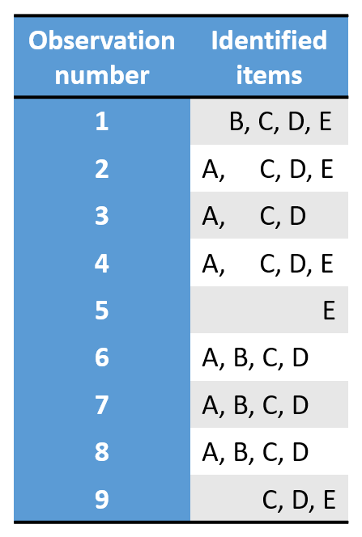
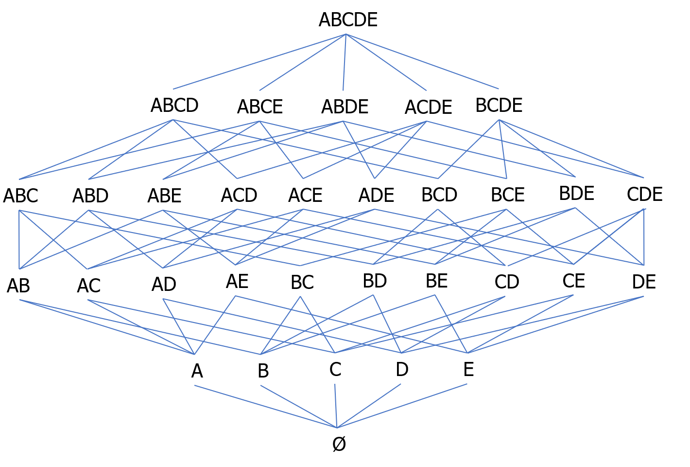
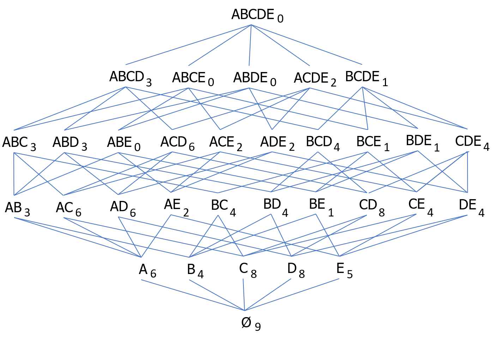
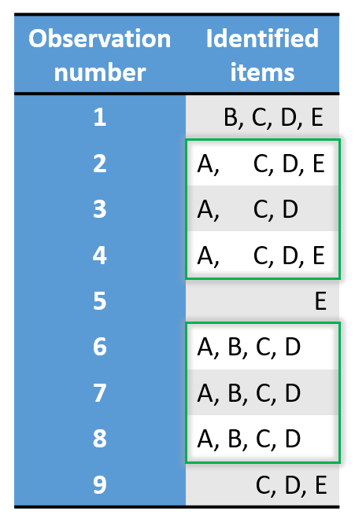
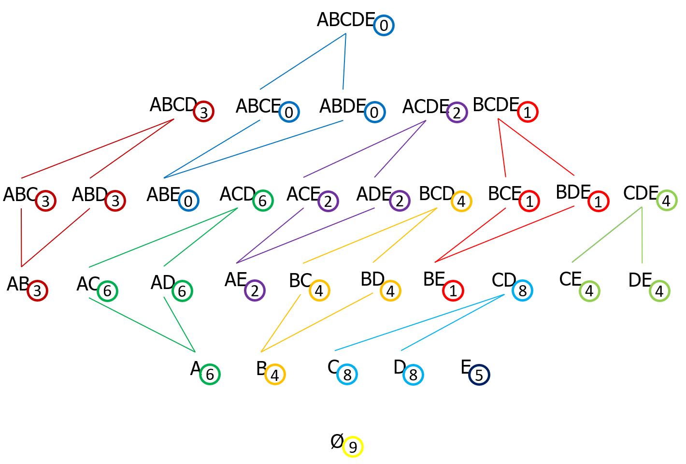
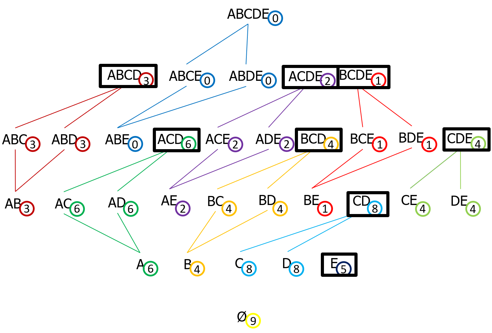
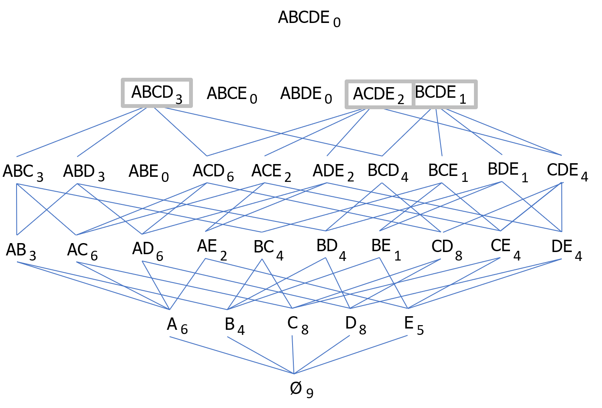
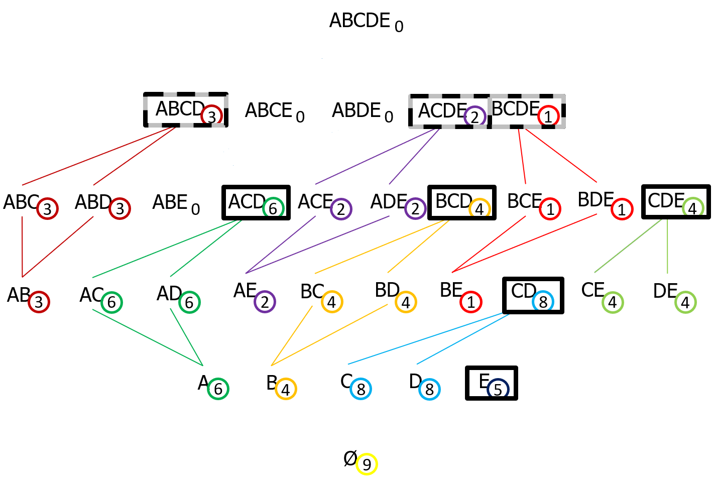

```{css, echo=FALSE}
h1:not(.title) {
  margin-top: 1.4rem;
}

img {
  vertical-align: middle;
}

.table {
  border: none;
  width: 25%;
}

.right_lattice {
  width: 69%;
}
```


# Itemsets and lattice

Here is the example we will use in this document. It is a list of 9 observations and the identified items of each one among $A$, $B$, $C$, $D$ and $E$:

<center>
{class=table}
</center>

Here is the lattice of the powerset of $\{A, B, C, D, E\}$ (i.e. a graph detailing the set of all subsets of $\{A, B, C, D, E\}$). This is the set of all possible itemsets:

<center>
{width=100%}
</center>


# Frequent itemsets

The one thing to do is to count occurrences of the itemsets in the observations:

<center>
{class=table} {class=right_lattice}
</center>

With a frequency threshold $\sigma$, the **frequent itemsets** are all itemsets that appear at least $\sigma$ times in the observations.

Using a frequency threshold of $1$ in the given example, frequent itemsets are all the itemsets from this lattice except $ABE$, $ABCE$, $ABDE$ and $ABCDE$ that never appear. If we do not take into account the empty set, that makes a total of 26 itemsets out of $2^{|\{A, B, C, D, E\}|} - 1 = 2^5 - 1 = 31$ possible itemsets.


# Closed frequent itemsets

For this, the second point after counting occurrences is to define the equivalence classes.

An **equivalence class** is the set of itemsets appearing in the same observations. In such a class, all itemsets share the same number of occurrences.

In the following picture, each color represents one equivalence class:

<center>
{class=table} {class=right_lattice}
</center>

For example, the dark green equivalence class is the set of the itemsets $A$, $AC$, $AD$ and $ACD$. That means that all observations containing the item $A$ are all observations containing the itemsets $AC$, $AD$ an $ACD$. In other words, saying we have found the item $A$ in an observation is equivalent to:

* Saying we have found the items $A$ and $C$;
* Saying we have found the items $A$ and $D$;
* Saying we have found the items $A$, $C$ and $D$.

We can then keep only the itemset $ACD$ and its occurrence value of 6 without losing any information by not keeping the three other itemsets. This itemset is the highest of its equivalence class: it is the maximal of its equivalence class.

**Closed frequent itemsets** are maximals of equivalence classes.

In our example, if we do not take into account the empty set and take a frequency threshold of $1$, that makes only 8 itemsets:

<center>
{class=table} {class=right_lattice}
</center>


# Maximal frequent itemsets

**Maximal frequent itemsets** are frequent itemsets which do not have any frequent superset. In other words, they are frequent itemsets which are not subsets of any other frequent itemset. They are the maximals by inclusion of the frequent itemsets and the positive boundary of the frequent itemsets.

In our example with a frequency threshold of $1$, there are 3 maximal frequent itemsets:

<center>
{class=table} {class=right_lattice}
</center>


# Summary

With a frequency threshold of $\sigma$:

* **Frequent itemsets** are all possible itemsets that appear at least $\sigma$ times in the observations.
* **Closed frequent itemsets** are frequent itemsets which do not have any superset in their equivalence classes defined with regard to frequency. They are a subset of the frequent itemsets synthesizing the information.
* **Maximal frequent itemsets** are frequent itemsets which do not have any frequent superset. They are a subset of the closed frequent itemsets.

In the following picture summarizing the example with a frequency threshold of 1:

* Frequent itemsets are those whose number of occurrences are circled.
* Closed frequent itemsets are those framed in black.
* Maximal frequent itemsets are those framed in grey.

<center>
{class=table} {class=right_lattice}
</center>


---
