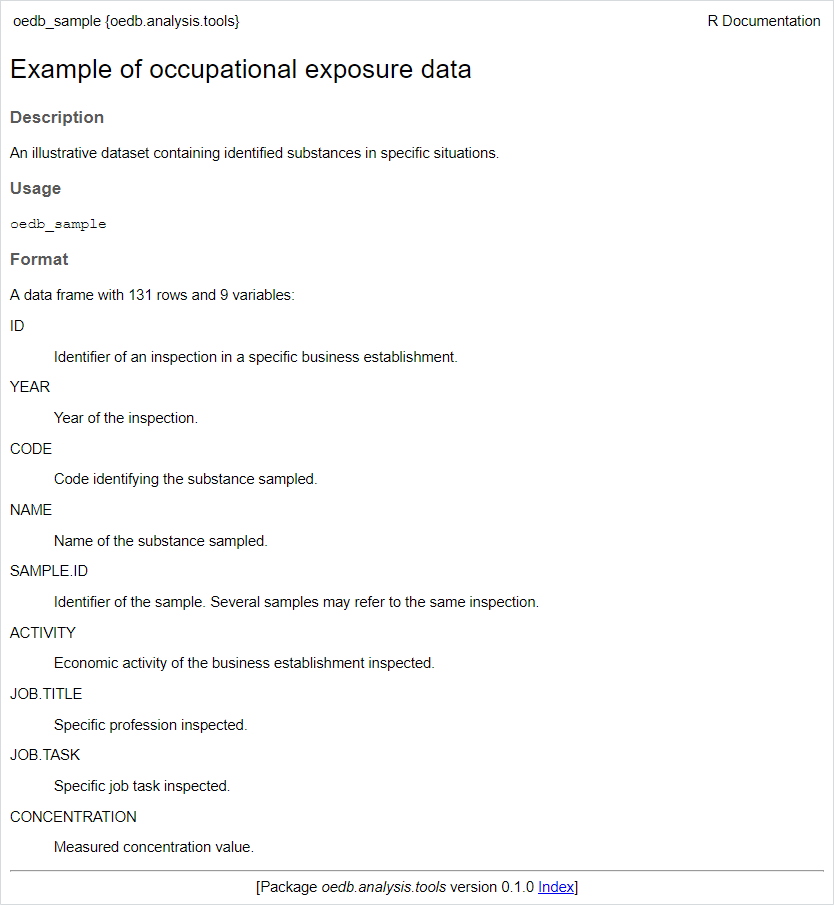
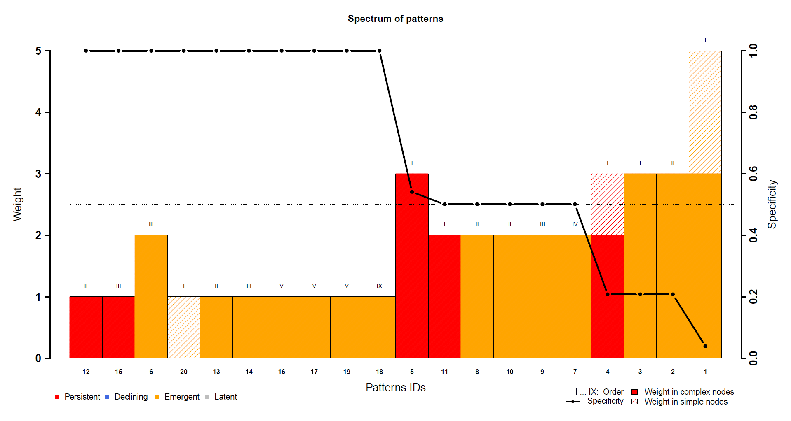
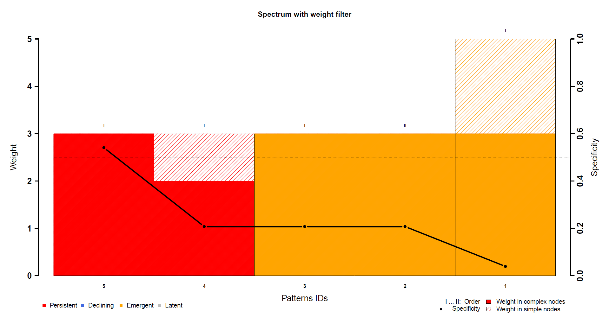
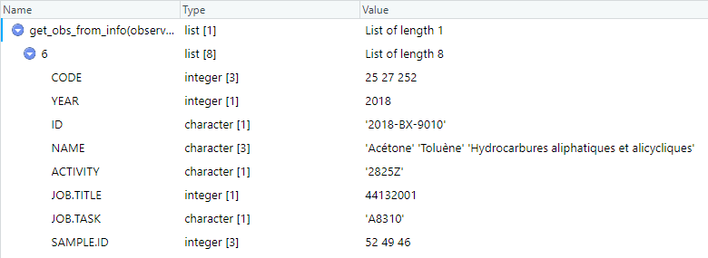

The example of analysis proposed in this document assumes the reader is familiar with the spectral analysis methodology. If not, the reader should read at least the first of the following two papers:

* Bosson-Rieutort D, de Gaudemaris R, Bicout DJ (2018). The spectrosome of occupational health problems. *PLoS ONE* 13(1): e0190196. <https://doi.org/10.1371/journal.pone.0190196>
* Bosson-Rieutort D, Sarazin P, Bicout DJ, Ho V, Lavoué J (2020). Occupational Co-exposures to Multiple Chemical Agents from Workplace Measurements by the US Occupational Safety and Health Administration. *Annals of Work Exposures and Health*, Volume 64, Issue 4, May 2020, Pages 402–415. <https://doi.org/10.1093/annweh/wxaa008>.

For more details about the functions used throughout this example (use of the parameters, other parameters and default values), it is recommended to consult the help pages of the functions along with it. Help pages can be access using the `help` function in your console or by referring to the [List of datasets, functions, classes and methods](#list-of-datasets-functions-classes-and-methods) section of this document.


# 1. Preparation of data and spectral analysis

## 1.1. Loading package and look at the example data

```{r}
# Loading package
library(oedb.analysis.tools)
```

Here are illustrative data from an occupational exposure database:
```{r}
oedb_sample
```
In this database, samples for which substances sought were not found have been removed; a filter was carried out on a particular work sector and a specific subset of data was extracted. Each line corresponds to a sample.

Here is the help page describing these data (accessible using `help(oedb_sample)`):



## 1.2. Construction of an observation structure from sampling data

### 1.2.1. Definition of the structure

Defining a set of work situations...
```{r}
work_situations <- data.frame(WS_ID = c(1, 2, 2, 3, 3),
                              JOB.TITLE = c(44121004, 44142001, 44132032, 44132019, 44132030),
                              JOB.TASK = c("A5440", "A6410", "A5110", "A5260", "A5240"),
                              stringsAsFactors = FALSE)
work_situations
```
These are work situations the user could identify beforehand. **The data frame must have a *WS_ID* column to identify the different work situations described.** The other columns correspond to the variables to use to describe a work situation and have the same names as the variables in the database used.

For this fictitious example, the variables named *JOB.TITLE* and *JOB.TASK* are used and random combinations were picked. Several couples with the same *WS_ID* are considered to correspond to the same work situation. Three work situations are described. The first one has one combination of the two variables. The second has two combinations which are considered as works with similar conditions. The last one is formed in the same way as the second one.


Defining the set of variables used to search for situations that have not been described in the previous data frame...
```{r}
variable_names <- c("JOB.TITLE", "JOB.TASK")
```
Each combination of these variables will be considered as a new work situation.

Defining the set of information to be kept in the observation structure...
```{r}
additional <- c("NAME", "ACTIVITY", "JOB.TITLE", "JOB.TASK", "SAMPLE.ID")
```
This is additional information which is not useful for spectral analysis but which allows to find a posteriori the context associated with the observations.


### 1.2.2. Construction of the observations

There are 4 possibilities here:

1. A single observation per inspection in an establisment...
```{r}
observations1 <- make_observations(oedb_sample,
                                   by = "ID",
                                   additional = c("CODE", additional),
                                   unique_values = TRUE)

# Print the number of observations
cat(length(observations1), "observations.\n")
```
```{r}
# Print one observation to see what it looks like
observations1[14]
```

2. For one inspection, search of the work situations described previously...
```{r}
observations2 <- make_INRS_observations(oedb_sample,
                                        mode = 2,
                                        work_situations = work_situations,
                                        additional = additional,
                                        unique_values = TRUE)

# Print the number of observations
cat(length(observations2), "observations.\n")
```
```{r}
# Print one observation
observations2[2]
```

3. For one inspection, as many work situations as different *JOB.TITLE*-*JOB.TASK* pairs...
```{r}
observations3 <- make_INRS_observations(oedb_sample,
                                        mode = 3,
                                        variable_names = variable_names,
                                        additional = additional,
                                        unique_values = TRUE)

# Print the number of observations
cat(length(observations3), "observations.\n")
```
```{r}
# Print one observation
observations3[2]
```

4. Combination of points 2 and 3: search of the work situations described previously and one observation per situation not described (*JOB.TITLE*-*JOB.TASK* pair) concerning the remaining samples...
```{r}
observations4 <- make_INRS_observations(oedb_sample,
                                        mode = 1,
                                        work_situations = work_situations,
                                        variable_names = variable_names,
                                        additional = additional,
                                        unique_values = TRUE)

# Print the number of observations
cat(length(observations4), "observations.\n")
```
```{r}
# Print one observation
observations4[2]
```

**Note that the function used to create the last three lists of observations need the dataset to contain 3 variables named *ID*, *YEAR* and *CODE* to be able to function.**

For the rest of the example, use of the last one...
```{r}
observations <- observations4
```


## 1.3. Set up the analysis

### 1.3.1. Association of each substance to categories

Here is a data frame associating substances to one family of substances and one subfamily:
```{r}
substances_classification
```

Classification of the substances from the observations according to their subfamily...
```{r}
# Search for separate substances
substances <- get_all_items(observations)
# Search for the subfamily associated to each substance
families <- substances_classification$SUBFAMILY[match(substances, substances_classification$CODE)]
# As a precaution, assignment of a specific value to substances for which no family has been found
families[is.na(families)] <- "Unknown"
# Search for the name associated to each substance
names <- substances_classification$NAME[match(substances, substances_classification$CODE)]

# Print the number of separate substances
cat(length(substances), "substances.")
```
```{r}
# Print the codes of all substances found in the observations
substances
```
```{r}
# Print the number of separate families
cat(length(unique(families)), "families.")
```
```{r}
# Print names of all families of substances found in the observations
unique(families)
```

Creation of a table associating each substance with its name and some categories...
```{r}
items <- data.frame(item = substances,
                    name = names,
                    family = families)
items
```


The column corresponding to the substance codes must be named **item**. The one corresponding to the substance names (which is optional) must be named **name**. The other names (for categories, which are also optional) are free.

Creation here of a *family* category corresponding to the subfamily associated with each substance.

Add other variables to the data frame to associate additional categories.


### 1.3.2. Instanciation of the object in charge of the analysis

Use of the default values to create a spectral analyzer (see the documentation for function *spectral.analyzer()*)...
```{r}
sa_object <- spectral.analyzer(observations, items)
```

The execution time for each step is displayed in the form [01h 22m 05s].

The *warning* message appearing is generated by one package used (*arules*) which informs that the choice of a minimum frequency of 1 for the enumeration of the patterns risks requiring more memory than available in case where a lot of data is used and many patterns exist. That is not the case here.


### 1.3.3. The resulting object

Some information about the data and the results of the spectral analysis calculations...
```{r}
summary(sa_object)
```
Let's take a look at the structure of the object...
```{r}
# Try this on your console to see more than the following picture
View(sa_object)
```


Some of these attributes will be saved in output files (see the following sections).

To have a description of the attributes, use `help("SpectralAnalyzer")`.
To know more about the types of attributes and methods variables, see *Types_of_attributes_and_methods.pdf* in the *doc* directory.


## 1.4. Saving the first results

Let's create a directory for the outputs...
```{r}
directory <- "./output/"
dir.create(directory)
```

Saving the object...
```{r}
saveRDS(sa_object, paste0(directory, "spectral_analyzer_object.RDS"))
```

Take a look at the nodes and the patterns...
```{r}
sa_object["nodes"]
```


```{r}
sa_object["patterns"]
```


Saving the nodes and the patterns in CSV files...
```{r}
# Saving the nodes
save_characteristics(sa_object, "nodes", sa_object["nodes"],
                     file = paste0(directory, "sao.nodes.csv"), row.names = FALSE)
# Saving the patterns
save_characteristics(sa_object, "patterns", sa_object["patterns"],
                     file = paste0(directory, "sao.patterns.csv"), row.names = FALSE)
```


# 2. Dealing with nodes

## 2.1. Node visualization

```{r}
# Let's organize it a little bit more
directory <- "./output/spec_nodes/"
dir.create(directory)
```

Creation of the spectrosome of the nodes...
```{r}
spectrosome <- spectrosome_chart(sa_object, "nodes", sa_object["nodes"],
                                 path = directory,
                                 name = "spectrosome_of_nodes.png",
                                 title = "Network of nodes")
```


Saving vertex characteristics in a CSV file...
```{r}
save_characteristics(sa_object, "nodes",
                     spectrosome[["vertices"]],
                     file = paste0(directory, "spectrosome_of_nodes-vertices.csv"),
                     row.names = FALSE)

spectrosome[["vertices"]]
```


The vertices of this spectrosome are actually the nodes already saved before as *sao.nodes.csv* in section 1.4., but the new data frame also lists the identifiers of the vertices in the graph as well as their degrees (i.e. the number of adjacent vertices).

Saving edges characteristics as well...
```{r}
write.csv2(spectrosome[["edges"]],
           file = paste0(directory, "spectrosome_of_nodes-edges.csv"),
           row.names = FALSE)

spectrosome[["edges"]]
```


## 2.2. Extraction of a cluster of nodes


Extraction of the node cluster relating to the item *3146*...
```{r}
item <- 3146
cluster <- cluster_chart(sa_object, "nodes", sa_object["nodes"], item,
                         path = directory,
                         name = paste0("node_cluster_of_", item, ".png"),
                         title = paste("Network cluster of", item))
```
**Note that no graphic is created and *cluster* is *NULL* if none or only one node contains the desired substance (which is here the substance having the code *3146*).**


Saving vertex characteristics in a CSV file...
```{r}
save_characteristics(sa_object, "nodes",
                     cluster[["vertices"]],
                     file = paste0(directory, "node_cluster_of_", item, "-vertices.csv"),
                     row.names = FALSE)

cluster[["vertices"]]
```


Saving edges characteristics as well...
```{r}
write.csv2(cluster[["edges"]],
           file = paste0(directory, "node_cluster_of_", item, "-edges.csv"),
           row.names = FALSE)

cluster[["edges"]]
```


# 3. Dealing with patterns

## 3.1. Pattern visualizations

### 3.1.1. Spectrum

```{r}
directory <- "./output/spec_patterns/"
dir.create(directory)
```

Creation of the pattern spectrum...
```{r}
spectrum <- spectrum_chart(sa_object, sa_object["patterns"],
                           path = directory,
                           name = "spectrum_of_patterns.pdf",
                           title = "Spectrum of patterns")
```


Saving pattern characteristics in a CSV file...
```{r}
save_characteristics(sa_object, "patterns",
                     spectrum,
                     file = paste0(directory, "spectrum_of_patterns.csv"),
                     row.names = FALSE)
```
Patterns presented in this spectrum are the ones already saved before as "sao.patterns.csv" in section 1.4.


### 3.1.2. Spectrosome

Creation of the spectrosome of the patterns...
```{r}
spectrosome <- spectrosome_chart(sa_object, "patterns", sa_object["patterns"],
                                 path = directory,
                                 name = "spectrosome_of_patterns.png",
                                 title = "Network of patterns")
```


Saving vertex characteristics in a CSV file...
```{r}
save_characteristics(sa_object, "patterns",
                     spectrosome[["vertices"]],
                     file = paste0(directory, "spectrosome_of_patterns-vertices.csv"),
                     row.names = FALSE)
# Here they are again the same patterns
```

Saving edges characteristics as well...
```{r}
write.csv2(spectrosome[["edges"]],
           file = paste0(directory, "spectrosome_of_patterns-edges.csv"),
           row.names = FALSE)

spectrosome[["edges"]]
```

```{r}
# Print the network density
cat("Network density:", network_density(sa_object, spectrosome[["edges"]]))
```


### 3.1.3. Multi-association tree

Creation of the multi-association tree...
```{r}
tree <- tree_chart(sa_object, sa_object["patterns"],
                   n.cutoff = 20,
                   c.cutoff = 17,
                   path = directory,
                   name = "multi-association_tree.pdf",
                   title = "Multi-association tree")
```


**Note that too many values for the displayed category or too long names prevent the legend from being displayed entirely, hence the use of the *c.cutoff* parameter to reduce the size of these values. Likewise, the *n.cutoff* allow to shorten the names of long substances.**

Saving pattern characteristics in a CSV file...
```{r}
save_characteristics(sa_object, "patterns",
                     tree,
                     file = paste0(directory, "multi-association_tree.csv"),
                     row.names = FALSE)

tree
```


See that only patterns with an order value greater than 1 are plotted on this kind of chart.


## 3.2. Extraction of a cluster of patterns

Extraction of the pattern cluster relating to the item *3146*...
```{r}
item <- 3146
cluster <- cluster_chart(sa_object, "patterns", sa_object["patterns"], item,
                         path = directory,
                         name = paste0("pattern_cluster_of_", item, ".png"),
                         title = paste("Network cluster of", item))
```
**Note that no graphic is created and *cluster* is *NULL* if none or only one pattern contains the desired substance (which is here the substance having the code *3146*).**


Saving vertex characteristics in CSV format...
```{r}
save_characteristics(sa_object, "patterns",
                     cluster[["vertices"]],
                     file = paste0(directory, "pattern_cluster_of_", item, "-vertices.csv"),
                     row.names = FALSE)

cluster[["vertices"]]
```


Saving edges characteristics as well...
```{r}
write.csv2(cluster[["edges"]],
           file = paste0(directory, "pattern_cluster_of_", item, "-edges.csv"),
           row.names = FALSE)

cluster[["edges"]]
```


# 4. Filters on nodes and patterns

```{r}
directory <- "./output/spec_filter/"
dir.create(directory)
```


## 4.1. Example of pattern weight filter

Selection of patterns with filter according to weight...
```{r}
# For example: patterns with at least a weight of 3
min_weight <- 3
patterns <- extract_patterns_from_characteristic(sa_object, sa_object["patterns"],
                                                 characteristic = "weight",
                                                 value = min_weight,
                                                 condition = "GE")

patterns
```


Associated spectrum...
```{r}
spectrum <- spectrum_chart(sa_object, patterns,
                           path = directory,
                           name = paste0("spectrum_of_patterns-w", min_weight, ".pdf"),
                           title = paste("Spectrum with weight filter"))
```


Associated spectrosome...
```{r}
spectrosome <- spectrosome_chart(sa_object, "patterns", patterns,
                                 path = directory,
                                 name = paste0("spectrosome_of_patterns-w", min_weight, ".png"),
                                 title = "Spectrosome with weight filter")
```


## 4.2. Example of pattern status filter

Selection of patterns with filter according to status...
```{r}
# For example: patterns with a status "Persistent"
status <- sa_object["Class"]$STATUS_PERSISTENT
patterns <- extract_patterns_from_status(sa_object, sa_object["patterns"],
                                         value = status,
                                         condition = "EQ")

patterns
```


**Note that after applying a filter, the patterns keep their line identifiers from the whole set of patterns.**

Associated spectrum...
```{r}
spectrum <- spectrum_chart(sa_object, patterns,
                           path = directory,
                           name = paste0("spectrum_of_patterns-", status, ".pdf"),
                           title = paste("Spectrum with status filter"))
```


Associated spectrosome...
```{r}
spectrosome <- spectrosome_chart(sa_object, "patterns", patterns,
                                 path = directory,
                                 name = paste0("spectrosome_of_patterns-", status, ".png"),
                                 title = "Spectrosome with status filter")
```

```{r}
# Print the network density
cat("Network density:", network_density(sa_object, spectrosome[["edges"]]))
```


## 4.3. Specific case of category filters

### 4.3.1. Patterns related to one specific family

```{r}
directory <- "./output/spec_family/"
dir.create(directory)
```

Substances in the family *Chrome*...
```{r}
items[items$family == "Chrome", ]
```

Selection of patterns which contain any substance in the family *Chrome*...
```{r}
patterns <- extract_patterns_from_category(sa_object, sa_object["patterns"],
                                           category = "family",
                                           value = "Chrome",
                                           target = "items")
patterns
```


Spectrosome related to this selection...
```{r}
name <- "spectrosome_of_patterns-Chrome-vertices"
spectrosome <- spectrosome_chart(sa_object, "patterns", patterns,
                                 path = directory,
                                 name = name,
                                 title = "Spectrosome of category Chrome")
```


Saving vertex characteristics in a CSV file...
```{r}
save_characteristics(sa_object, "patterns",
                     spectrosome[["vertices"]],
                     file = paste0(directory, name, "-vertices.csv"),
                     row.names = FALSE)

spectrosome[["vertices"]]
```


And saving edges characteristics in CSV format...
```{r}
write.csv2(spectrosome[["edges"]],
           file = paste0(directory, name, "-edges.csv"),
           row.names = FALSE)

spectrosome[["edges"]]
```


### 4.3.2. Patterns generating links corresponding to one specific family

Substances in the family *Chrome* (the same as in the previous section)...
```{r}
items[items$family == "Chrome", ]
```

Selection of patterns which generate links in which any substance belongs to the family *Chrome*...
```{r}
patterns <- extract_patterns_from_category(sa_object, sa_object["patterns"],
                                           category = "family",
                                           value = "Chrome",
                                           target = "links")
patterns
```


**Note that the difference between this section and the previous one is that there is less patterns because some of the previous ones are not linked with other by a substance in the sought category (although they are effectively linked by other substances).**

Spectrosome related to this selection...
```{r}
name <- "spectrosome_of_patterns-Chrome-edges"
spectrosome <- spectrosome_chart(sa_object, "patterns", patterns,
                                 path = directory,
                                 name = paste0(name, ".png"),
                                 title = paste("Spectrosome of category Chrome"))
```


Saving vertex characteristics in a CSV file...
```{r}
save_characteristics(sa_object, "patterns",
                     spectrosome[["vertices"]],
                     file = paste0(directory, name, "-vertices.csv"),
                     row.names = FALSE)

spectrosome[["vertices"]]
```


And saving edges characteristics in a CSV file...
```{r}
write.csv2(spectrosome[["edges"]],
           file = paste0(directory, name, "-edges.csv"),
           row.names = FALSE)

spectrosome[["edges"]]
```


# 5. Ad-hoc analysis

## 5.1. Processing on observations

Enumerate all items in a list of observations...
```{r}
get_all_items(sa_object["observations"])
```


Selection of observations containing a desired substance or set of substances...
```{r}
# For example, observations in which there is the item which has the code 25
View(get_obs_from_items(sa_object["observations"],
                        items = 25,
                        presence = "all"))
```


Selection of observations corresponding to a desired work situation...
```{r}
# Search for observations for which the additional information "JOB.TITLE" and "JOB.TASK" correspond respectively to 44132001 and "A8310"
View(get_obs_from_info(sa_object["observations"],
                       JOB.TITLE = 44132001,
                       JOB.TASK = "A8310"))
```


Search for substances found in observations associated with a work situation...
```{r}
get_items_from_info(sa_object["observations"],
                    JOB.TITLE = 44121004,
                    JOB.TASK = "A5440")
```

Search for situations associated with a desired substance...
```{r}
# Search for the information "JOB.TITLE" and "JOB.TASK" associated to observations in which there is the item 3146
get_info_from_items(sa_object["observations"],
                    items = 3146,
                    info_names = c("JOB.TITLE", "JOB.TASK"))
```

Compute some proportions...
```{r}
# Proportion of situations involving more than one substance
length(get_complex_obs(sa_object["observations"])) / length(sa_object["observations"])
```
```{r}
# Proportion of involvement of each substance in multiple exposures
co_occurrence_proportions(sa_object["observations"])
```


## 5.2. Substance code correspondance with names and categories

Names and categories of specific substances...
```{r}
# For example substances which have the codes 328, 929 and 3146
substances_sought <- c(328, 929, 3146)
substances_names <- names(sa_object["items"])[sa_object["items"] %in% substances_sought]
substances_categories <- sa_object["items_categories"][as.character(substances_sought), ]

result <- data.frame(substances_sought,
                     substances_names,
                     substances_categories)
setNames(result, c("item", "name", colnames(sa_object["items_categories"])))
```

Families associated with specific set of substances
```{r}
# Categories of the substances of one specific pattern from the whole set of patterns
sa_object["items_categories"][sa_object["patterns"]$pattern[[2]], ]
```
```{r}
# Or from one specific pattern from a spectrosome resulting from a previous filter
sa_object["items_categories"][spectrosome[["vertices"]]$pattern[[1]], ]
```


## 5.3. Some chart alternatives

```{r}
directory <- "./output/alternatives/"
dir.create(directory)
```

Some possible alternatives:

* If the status are not relevant for the desired analysis, some parameters allow to ignore them on charts.
* Because vertices of the spectrosome are positioned partially randomly, it may be necessary to redo a graph to get better readability. A parameter allows to plot as many spectrosome as you want.
* Another parameter allows to reduce the number of links displayed on a spectrosome according to their weight.

```{r}
# Plot 3 spectrosomes coloring the vertices with the categories
spectrosome_1 <- spectrosome_chart(sa_object, "patterns", sa_object["patterns"],
                                   vertex_col = "categories",
                                   nb_graphs = 3,
                                   path = directory,
                                   name = "spectrosome_of_patterns-no_status.png")
```


One can choose one of the three spectrosomes plotted and reuse it with the parameter *coord*. For instance, one can plot again the third spectrosome with another constraint on links:
```{r}
# Spectrosomes with several values for the parameter defining the minimum weight of a link to be plotted.
for (min_weight in seq(2, 5)) {
  spectrosome_w <- spectrosome_chart(sa_object, "patterns", sa_object["patterns"],
                                     min_link_weight = min_weight,
                                     vertex_col = "categories",
                                     path = directory,
                                     name = paste0("spectrosome_of_patterns-weight", min_weight),
                                     coord = spectrosome_1$coords[[3]])
}
```


## 5.4. Extracting association rules

There are 4 ways to look for association rules (i.e. implication between two itemsets):

1. Looking for all rules within the observations.
2. Looking for rules whose union of the antecedent and the consequent form an entier pattern.
3. Looking for rules whose union of the antecedent and the consequent form an entier itemset among those defined in argument.
4. Looking for rules related to items specify in arguments as antecedent or consequent.

**Note that only rules with one item in the consequent are created.**

```{r}
# All rules (with a support threshold of 0.1)
rules_1 <- extract_rules(sa_object, from = "observations")
rules_1
```


```{r}
# Rules forming the patterns (without support threshold)
rules_2 <- extract_rules(sa_object, from = "patterns")
rules_2
```


```{r}
# Rules forming 2 specific itemsets
rules_3 <- extract_rules(sa_object, from = list(c("931", "3180"),
                                                c("25", "192", "328")))
rules_3
```


```{r}
# Rules having the substance "328" as consequent and only one substance as antecedent
rules_4a <- extract_rules(sa_object, from = "observations",
                          parameter = list(supp = 0.001, conf = 0.5, maxlen = 2),
                          appearance = list(rhs = "328"))
rules_4a
```


The confidence of 1 means that the substance *328* is found each time the substance *192* is found. In other words, the presence of the substance *192* implies that of the substance *328*.

```{r}
# Rules having the substance "497" as antecedent
rules_4b <- extract_rules(sa_object, from = "observations",
                          parameter = list(supp = 0.001, conf = 0.5, maxlen = 2),
                          appearance = list(lhs = "497"))
rules_4b
```


```{r eval=FALSE}
# Rules in which the substance "328" is the antecedent and the substance "3180" is the consequent (with confidence threshold of 0)
rules_4c <- extract_rules(sa_object, from = "observations",
                          parameter = list(supp = 0.001, conf = 0, minlen = 2, maxlen = 2),
                          appearance = list(lhs = "328", rhs = "3180"))
rules_4c
```
```{r eval=TRUE, echo=FALSE}
# Duplication of the previous chunk with the option echo=FALSE so that the source is not divided into two blocks
rules_4c <- extract_rules(sa_object, from = "observations",
                          parameter = list(supp = 0.001, conf = 0, minlen = 2, maxlen = 2),
                          appearance = list(lhs = "328", rhs = "3180"))
rules_4c
```

The *NULL* result means that no association rule exists between the substances *328* as antecedent and *3180* as consequent. In other words, the presence of the substance *328* implies the absence of the substance *3180*.

Rules are saved in the same way as for nodes or patterns.
```{r}
directory <- "./output/rules/"
dir.create(directory)

save_characteristics(sa_object, "rules", rules_1,
                     file = paste0(directory, "rules.csv"), row.names = FALSE)
```


# List of datasets, functions, classes and methods

The package help page: [oedb.analysis.tools](../html/oedb.analysis.tools-package.html)

## Datasets

Datasets used as examples:

* [oedb_sample](../html/oedb_sample.html)
* [substances_classification](../html/substances_classification.html)
* [SA_instance](../html/SA_instance.html)


## About observations

Making observations:

* [make_observations](../html/make_observations.html)
* [make_INRS_observations](../html/make_INRS_observations.html)

Search for observations:

* [get_complex_obs](../html/get_complex_obs.html)
* [get_simple_obs](../html/get_simple_obs.html)
* [get_obs_from_items](../html/get_obs_from_items.html)
* [get_obs_from_info](../html/get_obs_from_info.html)

Search in observations:

* [get_all_items](../html/get_all_items.html)
* [get_items_from_info](../html/get_items_from_info.html)
* [get_info_from_items](../html/get_info_from_items.html)

Computations on observations:

* [co_occurrence_proportions](../html/co_occurrence_proportions.html)


## About spectral analysis

The class: [SpectralAnalyzer](../html/SpectralAnalyzer-class.html)

Making *SpectralAnalyzer* objects:

* [spectral.analyzer](../html/spectral.analyzer.html)
* [reset](../html/reset-SpectralAnalyzer-method.html)
* [\[<-](../html/sub-SpectralAnalyzer-ANY-ANY-ANY-method.html)

Making charts:

* [spectrosome_chart](../html/spectrosome_chart-SpectralAnalyzer-method.html)
* [cluster_chart](../html/cluster_chart-SpectralAnalyzer-method.html)
* [spectrum_chart](../html/spectrum_chart-SpectralAnalyzer-method.html)
* [tree_chart](../html/tree_chart-SpectralAnalyzer-method.html)

Search for nodes or patterns:

* [get_complexes](../html/get_complexes-SpectralAnalyzer-method.html)
* [get_isolates](../html/get_isolates-SpectralAnalyzer-method.html)
* [get_non_isolates](../html/get_non_isolates-SpectralAnalyzer-method.html)
* [extract_nodes_from_items](../html/extract_nodes_from_items-SpectralAnalyzer-method.html)
* [extract_nodes_from_characteristic](../html/extract_nodes_from_characteristic-SpectralAnalyzer-method.html)
* [extract_nodes_from_category](../html/extract_nodes_from_category-SpectralAnalyzer-method.html)
* [extract_patterns_from_items](../html/extract_patterns_from_items-SpectralAnalyzer-method.html)
* [extract_patterns_from_characteristic](../html/extract_patterns_from_characteristic-SpectralAnalyzer-method.html)
* [extract_patterns_from_status](../html/extract_patterns_from_status-SpectralAnalyzer-method.html)
* [extract_patterns_from_category](../html/extract_patterns_from_category-SpectralAnalyzer-method.html)

Search for links between nodes or between patterns:

* [get_links](../html/get_links-SpectralAnalyzer-method.html)

Computations on spectrosomes:

* [degree](../html/degree-SpectralAnalyzer-method.html)
* [network_density](../html/network_density-SpectralAnalyzer-method.html)

Saving nodes or patterns:

* [save_characteristics](../html/save_characteristics-SpectralAnalyzer-method.html)


## About association rules and sets

Extracting and saving rules:

* [extract_rules](../html/extract_rules-SpectralAnalyzer-method.html)
* [save_characteristics](../html/save_characteristics-SpectralAnalyzer-method.html)

Switching between mathematical notation and vector notation for sets:

* [vector_notation](../html/vector_notation.html)
* [set_notation](../html/set_notation.html)


## About the maximum cumulative ratio approach

Computation of main indicators:

* [hazard_quotient](../html/hazard_quotient.html)
* [hazard_index](../html/hazard_index.html)
* [maximum_hazard_quotient](../html/maximum_hazard_quotient.html)
* [maximum_cumulative_ratio](../html/maximum_cumulative_ratio.html)
* [missed_toxicity](../html/missed_toxicity.html)

Computation of additional indicators:

* [reciprocal_of_mcr](../html/reciprocal_of_mcr.html)
* [top_hazard_quotient](../html/top_hazard_quotient.html)
* [thq_pairs_freq](../html/thq_pairs_freq.html)
* [classify_mixture](../html/classify_mixture.html)
* [thq_freq_by_group](../html/thq_freq_by_group.html)


---
