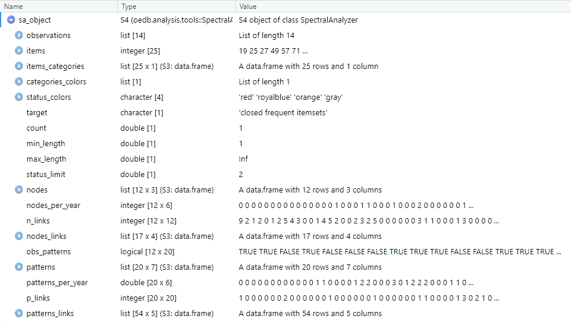
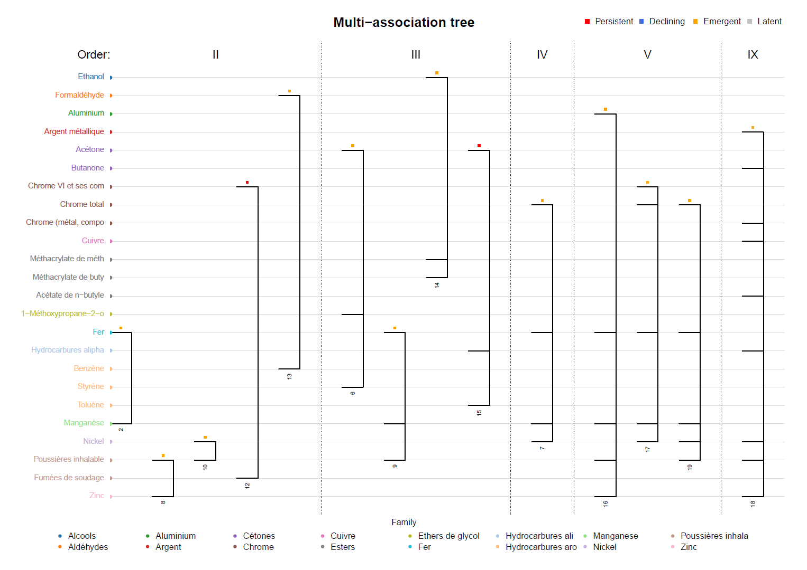
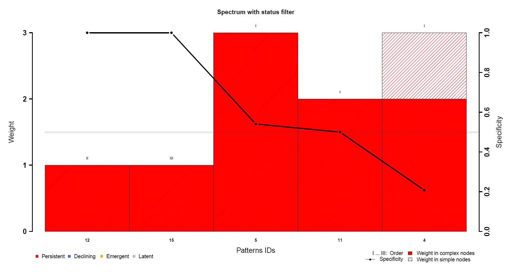
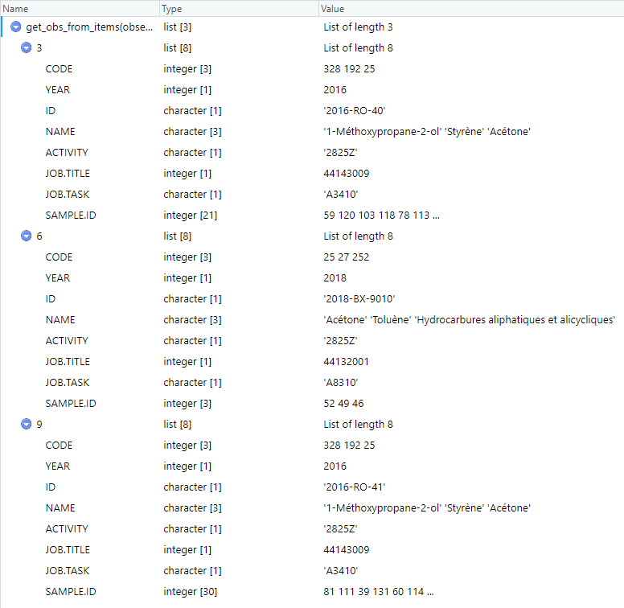

# 1. Preparation of data and spectral analysis

## 1.1. Loading functions, classes and data

Loading the class allowing spectral analysis and other functions necessary for its operation...
```{r}
source("../R/utils.R", encoding = "UTF-8")
source("../R/spectral_analyzer.R", encoding = "UTF-8")
```

Loading functions for aggregating data from samples into sets of observed substances...
```{r}
source("../R/observations_maker.R", encoding = "UTF-8")
```
These functions are constraining with regard to the names of the variables of the data frame. Four variables are necessary:

* **ID**: identifier of a sample.
* **ANNEE**: year of the sampling.
* **AC_NOM**: name of the chemical agent.
* **AC_CODE**: code of the chemical agent.

Loading example of data from an occupational exposure database...
```{r}
db = readRDS("../data/example_data.RDS")
db
```
In this databse, samples for which sought substances were not found have been removed; a filter was carried out on a particular work sector and a specific subset of data was extracted.


## 1.2. Construction of an observation structure from sampling data

### 1.2.1. Definition of the structure

Loading a set of workplace situations described beforehand...
```{r}
workplace_situations = read.csv2("../data/workplace_situations.csv",
                                 header = TRUE, stringsAsFactors = FALSE)
workplace_situations
```
The CSV file must have an **ID** column to identify the different workplace situations described. The other columns correspond to the variables that we want to use to describe a workplace situation and have the same names as the variables in the database used.

For this fictitious example, the variables named *METIER* and *TACHE* are used. Several couples with the same *ID* are considered to correspond to the same workplace situation.


Defining the set of variables used to search for situations that have not been described...
```{r}
variable_names = c("METIER", "TACHE")
```

Defining the set of information to be kept in the observation structure...
```{r}
additional = c("NAF", "METIER", "TACHE")
```
This is additional information which is not useful for spectral analysis but which allows to find a posteriori the context associated with the observations.


### 1.2.2. Construction of the observations

There are 4 possibilities here:

1. A single observation per inspection in an establisment...
```{r}
observations1 = turn_interventions_into_observations(db, additional)

# Print the number of observations
cat(length(observations1), "observations.\n")
```
```{r}
# Print one observation to see what it looks like
observations1[2]
```

2. For one inspection, research of the workplace situations described in a CSV file...
```{r}
observations2 = make_observations(db, 2, workplace_situations, additional = additional)

# Print the number of observations
cat(length(observations2), "observations.\n")
```
```{r}
# Print one observation
observations2[2]
```

3. For one inspection, as many workplace sitautions as different *METIER*-*TACHE* pairs...
```{r}
observations3 = make_observations(db, 3, variable_names = variable_names, additional = additional)

# Print the number of observations
cat(length(observations3), "observations.\n")
```
```{r}
# Print one observation
observations3[2]
```

4. Combination of points 2 and 3: search for the workplace situations described in the CSV file and one observation per situation not described (*METIER*-*TACHE* pair) concerning the remaining samples...
```{r}
observations4 = make_observations(db, 1, workplace_situations, variable_names, additional)

# Print the number of observations
cat(length(observations4), "observations.\n")
```
```{r}
# Print one observation
observations4[2]
```

For the rest of the example, use of the last one...
```{r}
observations = observations4
```


## 1.3. Set up the analysis

### 1.3.1. Association of each substance to categories

Loading the list of families of substances...
```{r}
family_agent = read.csv2("../data/family_agent.csv", stringsAsFactors = FALSE)
family_agent
```

Classification of chemical agents according to their family...
```{r}
# Search for separate substances
agents = sort(unique(unlist(sapply(observations, "[", "CODE"))))
# Search for family associated to each substance
families = family_agent$Famille[match(agents, family_agent$Code)]
# Assignment of a specific value to agents for which no family has been found in the CSV file
families[is.na(families)] = "Unknown"

# Print the number of separate substances
cat(length(agents), "substances.\n")
```
```{r}
# Print ID of all substances found in the observations
agents
```
```{r}
# Print the number of separate families
cat(length(unique(families)), "families.\n")
```
```{r}
# Print name of all families of substances found in the observations
unique(families)
```

Creation of a table associating each substance with some categories...
```{r}
categories = data.frame(item = agents,
                        family = families)
```


The column corresponding to the substance must be named **item**. The other names are free.

Creation here of a *family* category corresponding to the family associated with each substance.

Add other variables to the data frame to associate additional categories.


### 1.3.2. Instanciation of the object in charge of the analysis

Use of the default values (see the documentation for function *spectral.analyzer()* or the function itself in file *spectral_analyser.R*)...
```{r}
sa_object = spectral.analyzer(observations, items = categories)
```

The **arules** and **statnet** packages are automatically installed and loaded on initialization.

The execution time for each of the steps are displayed in the form [01h 22m 05s].

The *warning* message appearing is generated by the *arules* package which informs that the choice of a minimum frequency of 1 for the enumeration of the patterns risks requiring more memory than available in case where a lot of data is used and many patterns exist. That is not the case here.


### 1.3.3. The resulting object

Some information about the data and the results of the spectral analysis calculations...
```{r}
summary(sa_object)
```
Let's take a look at the structure of the object...
```{r}
# Try this on your console to see more than the following picture
View(sa_object)
```


Some of these attributes are saved in the output files (see the following sections).

To see more about the types of attributes and methods variables, see *Attribute_and_method_types.pdf* in the *man* folder.


## 1.4. Saving the first results

Let's create a directory for the outputs...
```{r}
directory = "./output/"
dir.create(directory)
```

Saving the object...
```{r}
saveRDS(sa_object, paste0(directory, "spectral_analyzer_object.RDS"))
```

Take a look at the nodes and the patterns...
```{r}
sa_object["nodes"]
```


```{r}
sa_object["patterns"]
```


Saving the nodes and patterns in a CSV file...
```{r}
# Saving the nodes
save_characteristics(sa_object, "nodes", sa_object["nodes"],
                     file = paste0(directory, "sao.nodes.csv"), row.names = FALSE)
# Saving the patterns
save_characteristics(sa_object, "patterns", sa_object["patterns"],
                     file = paste0(directory, "sao.patterns.csv"), row.names = FALSE)
```


# 2. Dealing with nodes

## 2.1. Node visualization

```{r}
# Let's organize it a little bit more
directory = "./output/spec_nodes/"
dir.create(directory)
```

Creation of the spectrosome of the nodes...
```{r}
spectrosome = spectrosome_chart(sa_object, "nodes", sa_object["nodes"],
                                path = directory,
                                name = "spectrosome_of_nodes.png",
                                title = "Network of nodes")
```


Saving vertex characteristics in a CSV file...
```{r}
save_characteristics(sa_object, "nodes",
                     spectrosome[["vertices"]],
                     file = paste0(directory, "spectrosome_of_nodes-vertices.csv"),
                     row.names = FALSE)

spectrosome[["vertices"]]
```


The vertices of this spectrosome are actually the nodes already saved before as *sao.nodes.csv* in section 1.4., but the new data frame also lists the identifiers of the vertices in the graph as well as their degrees (i.e. the number of adjacent vertices).

Saving edges characteristics as well...
```{r}
write.csv2(spectrosome[["edges"]],
           file = paste0(directory, "spectrosome_of_nodes-edges.csv"),
           row.names = FALSE)

spectrosome[["edges"]]
```


## 2.2. Extraction of a cluster of nodes


Extraction of the node cluster relating to the item *3146*...
```{r}
item = 3146
cluster = cluster_chart(sa_object, "nodes", item,
                        path = directory,
                        name = paste0("node_cluster_of_", item, ".png"),
                        title = paste("Network cluster of", item))
```
**Note that no graphic is created and *cluster* is *NULL* if none or only one node contains the desired substance (which is here the substance having the code *3146*).**


Saving vertex characteristics in a CSV file...
```{r}
save_characteristics(sa_object, "nodes",
                     cluster[["vertices"]],
                     file = paste0(directory, "node_cluster_of_", item, "-vertices.csv"),
                     row.names = FALSE)

cluster[["vertices"]]
```


Saving edges characteristics as well...
```{r}
write.csv2(cluster[["edges"]],
           file = paste0(directory, "node_cluster_of_", item, "-edges.csv"),
           row.names = FALSE)

cluster[["edges"]]
```


# 3. Dealing with patterns

## 3.1. Pattern visualizations

### 3.1.1. Spectrum

```{r}
directory = "./output/spec_patterns/"
dir.create(directory)
```

Creation of the pattern spectrum...
```{r}
spectrum = spectrum_chart(sa_object, sa_object["patterns"],
                         path = directory,
                         name = "spectrum_of_patterns.pdf",
                         title = "Spectrum of patterns")
```


Patterns presented in this spectrum are the ones already saved before as "sao.patterns.csv" in section 1.4.

Saving pattern characteristics in a CSV file...
```{r}
save_characteristics(sa_object, "patterns",
                     spectrum,
                     file = paste0(directory, "spectrum_of_patterns.csv"),
                     row.names = FALSE)
```


### 3.1.2. Spectrosome

Creation of the spectrosome of the patterns...
```{r}
spectrosome = spectrosome_chart(sa_object, "patterns", sa_object["patterns"],
                                path = directory,
                                name = "spectrosome_of_patterns.png",
                                title = "Network of patterns")
```


Saving vertex characteristics in a CSV file...
```{r}
save_characteristics(sa_object, "patterns",
                     spectrosome[["vertices"]],
                     file = paste0(directory, "spectrosome_of_patterns-vertices.csv"),
                     row.names = FALSE)
# Here they are again the same patterns
```

Saving edges characteristics as well...
```{r}
write.csv2(spectrosome[["edges"]],
           file = paste0(directory, "spectrosome_of_patterns-edges.csv"),
           row.names = FALSE)

spectrosome[["edges"]]
```

```{r}
# Print the network density
cat("Network density:", network_density(sa_object, spectrosome[["edges"]]))
```


### 3.1.3. Multi-association tree

Creation of the multi-association tree...
```{r}
tree = tree_chart(sa_object, sa_object["patterns"], "ID",
                  cutoff = 17,
                  path = directory,
                  name = "multi-association_tree.pdf",
                  title = "Multi-association tree")
```


**Note that too many values for the displayed category or too long names prevent the legend from being displayed correcly, hence the use of the cutoff parameter to reduce the size of these values.**

Saving pattern characteristics in a CSV file...
```{r}
save_characteristics(sa_object, "patterns",
                     tree,
                     file = paste0(directory, "multi-association_tree.csv"),
                     row.names = FALSE)

tree
```


See that only patterns with an order value greater than 1 are plotted on this kind of chart.


## 3.2. Extraction of a cluster of patterns

Extraction of the pattern cluster relating to the item *3146*...
```{r}
item = 3146
cluster = cluster_chart(sa_object, "patterns", item,
                        path = directory,
                        name = paste0("pattern_cluster_of_", item, ".png"),
                        title = paste("Network cluster of", item))
```
**Note that no graphic is created and *cluster* is *NULL* if none or only one pattern contains the desired substance (which is here the substance having the code *3146*).**


Saving vertex characteristics in CSV format...
```{r}
save_characteristics(sa_object, "patterns",
                     cluster[["vertices"]],
                     file = paste0(directory, "pattern_cluster_of_", item, "-vertices.csv"),
                     row.names = FALSE)

cluster[["vertices"]]
```


Saving edges characteristics as well...
```{r}
write.csv2(cluster[["edges"]],
           file = paste0(directory, "pattern_cluster_of_", item, "-edges.csv"),
           row.names = FALSE)

cluster[["edges"]]
```


# 4. Filters on nodes and patterns

```{r}
directory = "./output/spec_filter/"
dir.create(directory)
```


## 4.1. Example of pattern weight filter

Selection of patterns with filter according to weight...
```{r}
# For example: patterns with at least a weight of 3
min_weight = 3
patterns = extract_patterns_from_characteristic(sa_object, sa_object["patterns"],
                                                characteristic = "weight",
                                                value = min_weight,
                                                condition = "GE")

patterns
```


Associated spectrum...
```{r}
spectrum = spectrum_chart(sa_object, patterns,
                         path = directory,
                         name = paste0("spectrum_of_patterns-w", min_weight, ".pdf"),
                         title = paste("Spectrum with weight filter"))
```


Associated spectrosome...
```{r}
spectrosome = spectrosome_chart(sa_object, "patterns", patterns,
                                path = directory,
                                name = paste0("spectrosome_of_patterns-w", min_weight, ".png"),
                                title = "Spectrosome with weight filter")
```


## 4.2. Example of pattern status filter

Selection of patterns with filter according to status...
```{r}
# For example: patterns with a status "Persistent"
value = sa_object["Class"]$STATUS_PERSISTENT
patterns = extract_patterns_from_status(sa_object, sa_object["patterns"],
                                        value, "EQ")

patterns
```


**Note that after applying a filter, the patterns keep their line identifiers from the whole set of patterns.**

Associated spectrum...
```{r}
spectrum = spectrum_chart(sa_object, patterns,
                         path = directory,
                         name = paste0("spectrum_of_patterns-", value, ".pdf"),
                         title = paste("Spectrum with status filter"))
```


Associated spectrosome...
```{r}
spectrosome = spectrosome_chart(sa_object, "patterns", patterns,
                                path = directory,
                                name = paste0("spectrosome_of_patterns-", value, ".png"),
                                title = "Spectrosome with status filter")
```

```{r}
# Print the network density
cat("Network density:", network_density(sa_object, spectrosome[["edges"]]))
```


## 4.3. Specific case of category filters

### 4.3.1. Patterns related to one specific family

```{r}
directory = "./output/spec_family/"
dir.create(directory)
```

Substances in the family *Chrome*...
```{r}
categories[categories$family == "Chrome", ]
```

Selection of patterns with contain any substance in the family *Chrome*...
```{r}
patterns = extract_patterns_from_category(sa_object,
                                          category = "family",
                                          value = "Chrome",
                                          target = "vertices")
patterns
```


Spectrosome related to this selection...
```{r}
name = "spectrosome_of_patterns-Chrome-vertices"
spectrosome = spectrosome_chart(sa_object, "patterns", patterns,
                                path = directory,
                                name = paste0(name, ".png"),
                                title = "Spectrosome of category Chrome")
```


Saving vertex characteristics in a CSV file...
```{r}
save_characteristics(sa_object, "patterns",
                     spectrosome[["vertices"]],
                     file = paste0(directory, name, "-vertices.csv"),
                     row.names = FALSE)

spectrosome[["vertices"]]
```


And saving edges characteristics in CSV format...
```{r}
write.csv2(spectrosome[["edges"]],
           file = paste0(directory, name, "-edges.csv"),
           row.names = FALSE)

spectrosome[["edges"]]
```


### 4.3.2. Patterns generating links corresponding to one specific family

Substances in the family *Chrome* (the same as in the previous section)...
```{r}
categories[categories$family == "Chrome", ]
```

Selection of patterns with generate links in which any substance belongs to the family *Chrome*...
```{r}
patterns = extract_patterns_from_category(sa_object,
                                          category = "family",
                                          value = "Chrome",
                                          target = "edges")

patterns
```


**Note that the difference between this section and the previous one is that there is less patterns because some of the previous ones are not linked with other by a substance in the sought category (although they are effectively linked by other substances).**

Spectrosome related to this selection...
```{r}
name = "spectrosome_of_patterns-Chrome-edges"
spectrosome = spectrosome_chart(sa_object, "patterns", patterns,
                                path = directory,
                                name = paste0(name, ".png"),
                                title = paste("Spectrosome of category Chrome"))
```


Saving vertex characteristics in a CSV file...
```{r}
save_characteristics(sa_object, "patterns",
                     spectrosome[["vertices"]],
                     file = paste0(directory, name, "-vertices.csv"),
                     row.names = FALSE)

spectrosome[["vertices"]]
```


And saving edges characteristics in a CSV file...
```{r}
write.csv2(spectrosome[["edges"]],
           file = paste0(directory, name, "-edges.csv"),
           row.names = FALSE)

spectrosome[["edges"]]
```


# 5. Ad-hoc analysis

## 5.1. Processing on observations

Selection of observations containing a desired substance or set of substances...
```{r}
# For example, observations in which there is the item which has the code 25
View(extract_observations_from_items(observations, items = 25, "all"))
```


Selection of observations corresponding to a desired workplace situation...
```{r}
# Search for observations for which the additional information "METIER" and "TACHE" corresponding respectively to 44132001 and "A8310"
View(extract_observations_from_information(observations,
                                           info_names = c("METIER", "TACHE"),
                                           info_values = c(44132001, "A8310")))
```


Search for substances found in observations associated with a workplace situation...
```{r}
extract_items(observations,
              info_names = c("METIER", "TACHE"),
              info_values = c(44121004, "A5440"))
```

Search for situations associated with a desired substance...
```{r}
# Search for the information "METIER" and "TACHE" associated to observations in which there is the items 3146
extract_information(observations,
                    items = 3146,
                    info_names = c("METIER", "TACHE"))
```


## 5.2 Substance code correspondance with names and families

Table of correspondences between substance codes and substance names analyzed...
```{r}
AC = unique(db[db$AC_CODE %in% sa_object["items"], c("AC_CODE", "AC_NOM")])
AC
```

Name of specific substances...
```{r}
# For example substances which have the codes 497 and 3146
agents_ch = c(497, 3146)
AC[AC$AC_CODE %in% agents_ch, ]
```

Families associated with specific set of substances
```{r}
# Categories of two substances: for example 497 and 3146
categories[categories$item %in% c(497, 3146), ]
```
```{r}
# Categories of the substances of one specific pattern from the whole set of patterns
categories[categories$item %in% sa_object["patterns"]$pattern[[2]], ]
```
```{r}
# Or from one specific pattern from a spectrosome resulting from a previous filter
categories[categories$item %in% spectrosome[["vertices"]]$pattern[[1]], ]
```

---
