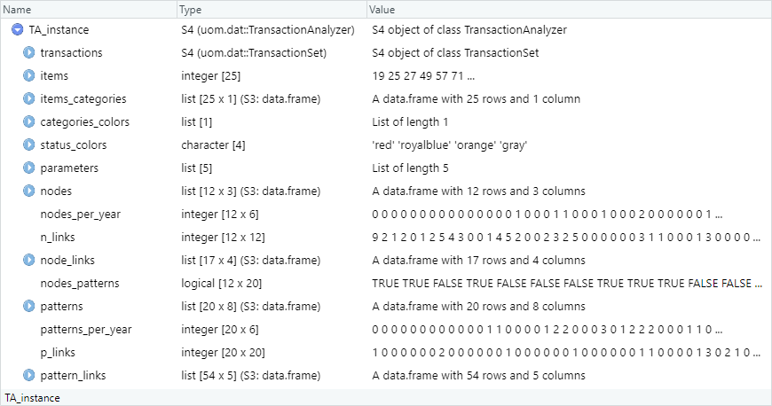

```{r setup, include=FALSE}
knitr::opts_chunk$set(fig.align = "center",
                      results = "hold")
```


In data mining, **transaction** analysis allows to find **frequent itemsets** and extract **association rules** to know patterns and implications about items. The **spectrosome approach** can be applied as well in order to consider given classifications about items, compute some additional indicators and plot several visualizations.

This document is the continuation of the one titled [Transaction sets](./transaction_sets.html) detailing the construction of objects of class `TransactionSet` and basic processing of transactions. It presents more analyzes to apply on transactions. The proposed examples are again in the field of occupational exposure to chemicals.


<p id="plan-announcement">The first section describes the structure of an object of class `TransactionAnalyzer` and how to create such objects. The second one presents methods to search specific entities contained in such objects. The third section presents how to extract associations rules. The fourth one proposes plots about the entities created by a `TransactionAnalyzer` object. The fifth section proposes some computations. Finally, the last one presents how to save the different entities and how to extend the use of `TransactionAnalyzer` with another package.</p>


```{r message=FALSE}
library(uom.dat)
```


# 1. Class TransactionAnalyzer

## 1.1. Structure of a transaction analyzer

### 1.1.1. In brief

An object of class `TransactionAnalyzer` is defined by the following.

* A `TransactionSet` object, containing the transactions to analyze.
* A set of items, identifying the items in the transactions. They are possibly associated with values for several user-defined categories.
* A list of analysis parameters, defining which kind of patterns to look for in the transactions and how to characterize them.

After initialization, it also contain the following.

* A set of nodes: the separate itemsets corresponding to the transactions.
* A set of patterns: the frequent itemsets found using the given parameters.
* Information about including patterns in nodes.
* Information about the links between nodes and between patterns, regarding the itemsets composing them.

### 1.1.2. Attributes

Each object of class `TransactionAnalyzer` has the following attributes.

<table>
<thead>
  <tr>
    <th>Name</th>
    <th>Data structure</th>
    <th>Description</th>
  </tr>
</thead>
<tbody>
  <tr>
    <td>`transactions`</td>
    <td align="center">`TransactionSet`</td>
    <td>S4 object of class `TransactionSet`. List of transactions containing the items corresponding to each one.</td>
  </tr>
  <tr>
    <td>`items`</td>
    <td align="center">`vector`</td>
    <td>Set of codes identifying the items found in the transactions.</td>
  </tr>
  <tr>
    <td>`items_categories`</td>
    <td align="center">`data.frame`</td>
    <td>Categories associated with the items. Each item is associated with one value for each category.</td>
  </tr>
  <tr>
    <td>`categories_colors`</td>
    <td align="center">`list`</td>
    <td>Colors associated with the values of the categories associated with the items.</td>
  </tr>
  <tr>
    <td>`status_colors`</td>
    <td align="center">`vector`</td>
    <td>Colors associated with the values of the status the patterns can have.</td>
  </tr>
  <tr>
    <td>`parameters`</td>
    <td align="center">`list`</td>
    <td>List of parameters for pattern search and characterization:<ul>
      <li>`target`: type of patterns to mine during the analysis.</li>
      <li>`min_frequency`: minimum number of occurrences that a pattern must appear to be kept when mining patterns.</li>
      <li>`min_length`: minimum number of items that a pattern must have to be kept when mining patterns.</li>
      <li>`max_length`: maximum number of items that a pattern must have to be kept when mining patterns.</li>
      <li>`status_limit`: time interval for which to characterize the status of the patterns in relation to the total period of transactions (number of years).</li></ul></td>
  </tr>
  <tr>
    <td>`nodes`</td>
    <td align="center">`data.frame`</td>
    <td>Set of nodes (separate transactions considering only their items) and characteristics of these nodes. Data frame containing the following 3 variables.<ul>
      <li>`node`: set of items composing the node.</li>
      <li>`length`: number of items composing the node.</li>
      <li>`frequency`: number of transactions for which the set of items matches exactly.</li></ul></td>
  </tr>
  <tr>
    <td>`nodes_per_year`</td>
    <td align="center">`matrix`</td>
    <td>Number of occurrences of each node in the transactions, per year.</td>
  </tr>
  <tr>
    <td>`n_links`</td>
    <td align="center">`matrix`</td>
    <td>Set of weights of the links between the nodes. Adjacency matrix containing the number of items in common between each pair of nodes.</td>
  </tr>
  <tr>
    <td>`node_links`</td>
    <td align="center">`data.frame`</td>
    <td>Set of links between the nodes and characteristics of these links. Isolated nodes (i.e. unrelated to any other node) appear at the bottom of the data structure. Data frame containing the following 4 variables.<ul>
      <li>`endpoint.1` and `endpoint.2`: identifiers of two nodes from the attribute `nodes`.</li>
      <li>`items`: ttems in common between the two nodes.</li>
      <li>`weight`: number of items in common between the two nodes.</li></ul></td>
  </tr>
  <tr>
    <td>`node_patterns`</td>
    <td align="center">`matrix`</td>
    <td>Set of associations between patterns and nodes determining whether a pattern is included in a node.</td>
  </tr>
  <tr>
    <td>`patterns`</td>
    <td align="center">`data.frame`</td>
    <td>Set of mined patterns and characteristics of these patterns. Data frame containing the following 8 variables.<ul>
    <li>`pattern`: set of items composing the pattern.</li>
    <li>`year`: year of appearance of the pattern among the transactions.</li>
    <li>`length`: number of items composing the pattern.</li>
    <li>`support`: proportion of transactions containing the set of items of the pattern.</li>
    <li>`frequency`: number of transactions containing the set of items of the pattern.</li>
    <li>`weight`: number of nodes containing the set of items of the pattern.</li>
    <li>`specificity`: specificity of the information conveyed by the pattern. It corresponds to the nature of a pattern of being specific of a particular combination or ubiquitous and allowing the formation of numerous combinations (with regard to the transactions).</li>
    <li>`status`: dynamic status of the pattern: persistent, declining, emergent or latent.</li></ul></td>
  </tr>
  <tr>
    <td>`patterns_per_year`</td>
    <td align="center">`matrix`</td>
    <td>Number of occurrences of each pattern in the transactions, per year.</td>
  </tr>
  <tr>
    <td>`p_links`</td>
    <td align="center">`matrix`</td>
    <td>Set of weights of the links between the patterns. Adjacency matrix containing the number of items in common between each pair of patterns.</td>
  </tr>
  <tr>
    <td>`pattern_links`</td>
    <td align="center">`data.frame`</td>
    <td>Set of links between the patterns and characteristics of these links. Isolated patterns (i.e. unrelated to any other pattern) appear at the bottom of the data structure. Data frame containg the following 5 variables.<ul>
    <li>`endpoint.1` and `endpoint.2`: identifiers of two patterns from the attribute `patterns`.</li>
    <li>`items`: items in common between the two patterns.</li>
    <li>`weight`: number of items in common between the two patterns.</li>
    <li>`year`: year of appearance of the link between the two patterns.</li></ul></td>
  </tr>
</tbody>
</table>

The attributes relating to colors ensure homogeneity between the different charts that can be plotted. Concerning the colors associated with the categories, default colors of each category are selected circularly among 20 colors. Therefore, if the number of values of one category exceed $20$, some colors will be used more than once.


## 1.2. TransactionAnalzyer example

Here is what we can see by calling the functions `View` and `print` on `TA_instance`, the example object of class `TransactionAnalyzer` accessible in the package.

```{r eval=FALSE}
View(TA_instance)
```
<center>
{class=border-none}
</center>

```{r}
print(TA_instance)
```

This `TransactionAnalyzer` is composed by a `TransactionSet` containing 14 transactions relating to 25 items. These items are associated with 1 category named "family", having 17 levels. The `TransactionSet` involves 12 separate transactions by the itemsets constituting them, i.e. 12 nodes. Patterns were mined by looking for closed frequent itemsets occurring at least once within the transactions and having any number of items. There are 20 patterns, i.e. 20 subsets of the transaction itemsets, that have been generated.

In this example:

* Items correspond to chemical substance identifiers.
* The associated category refers to the substance families.
* Transactions correspond to substances observed by atmospheric samples in specific workplaces.
* Nodes are separate sets of substances actually observed in these different workplaces.
* Patterns are itemsets, subsets of substances, extracted according to the search parameters.


## 1.3. Create TransactionAnalyzer objects

### 1.3.1. Function and main arguments

The function to use to create objects of class `TransactionAnalyzer` is `transaction.analyzer`.

The first step is to create a **transaction set** from a dataset, using one of the three functions detailled in the document [Transaction sets](./transaction_sets.html): `transaction.set`, `make_transactions` or `make_OE_transactions`. In order to define dynamic status to the patterns, it is necessary that the transactions contain temporal data. In other words, the attribute `year_key` of the `TransactionSet` used must be defined, different from `NA`.

While running the function `transaction.analyzer`, the items are automatically listed from the transaction set. However, information can be associated with the items by giving a data frame in which:

* **items** must be listed in a column named `item`.
* **names** can be listed in a column named `name`. The purpose is to distinguish item identifiers used in the transactions (the items; for instance: "49") and meaningful names (the names; for instance: "Ethanol").
* several **categories** can be listed in other columns. The names of these columns are used as category names. Such categories must be of type `factor`.

The parameters for pattern search and characterization may be given as arguments unless considering default values. They are the same as described in [1.1.2. Attributes](#attributes):

* `target`: type of patterns to mine during the analysis.
* `min_frequency`: minimum number of occurrences that a pattern must appear to be kept when mining patterns.
* `min_length`: minimum number of items that a pattern must have to be kept when mining patterns.
* `max_length`: maximum number of items that a pattern must have to be kept when mining patterns.
* `status_limit`: time interval for which to characterize the status of the patterns in relation to the total period of transactions (number of years).

The type of patterns mined (argument `target`) can be:

* `"frequent itemsets"`: itemsets appearing in the transactions according to an occurrence threshold (defined by the parameter `min_frequency`).
* `"closed frequent itemsets"`: maximal itemsets of equivalence classes. An equivalence class is defined as the set of itemsets appearing in the same transactions.
* `"maximally frequent itemsets"`: frequent itemsets which do not have any frequent superset. Also named as the maximals by inclusion of the frequent itemsets or the positive boundary of the frequent itemsets.

The frequent itemsets are an exhaustive list of frequent itemsets. The closed frequent itemsets synthesize the information so as to reduce the memory space required without real loss of information thanks to the equivalence classes. The maximal frequent itemsets required even less memory since they are a subset of the closed frequent itemsets. For an explanation with illustrated examples about the different types of itemsets, read the document titled [Itemset mining](./itemset_mining.html).

### 1.3.2. Initialization

#### Steps

While creating an object of class `TransactionAnalyzer`, the function `transaction.analyzer` perfoms the following initialization steps.

1. Enumeration of the transactions per year.
2. Enumeration of the nodes and calculation of the number of occurrences.
3. Counting links between nodes.
4. Elaboration of links between nodes.
5. Mining for itemsets.
6. Linking nodes to patterns.
7. Characterization of patterns per year.
8. Computation of pattern characteristics.
9. Counting links between patterns.
10. Elaboration of links between patterns.

Among them, the following steps may be quite long.

* Step 4 (elaboration of links between nodes), depending on the amount of data.
* Steps 5 and 6 (mining for itemsets and linking nodes to patterns), depending on the mining parameters and the amount of data.
* Step 10 (elaboration of links between patterns), depending on the amount of patterns, resulting from the mining parameters and the amount of data.

#### Example

Here is an example of `TransactionAnalyzer` creation using the datasets `oedb_sample` and `substances_informations` accessible in the package.

```{r}
# Creation of a TransactionSet object by grouping rows of 'oedb_sample' having
# the same 'ID'.
trx_object <- make_transactions(oedb_sample,
                                by = "ID",
                                additional = c("CODE", "NAME", "YEAR"),
                                item_key = "CODE",
                                year_key = "YEAR")

# Creation of a data.frame associating item identifiers with item names
# and with one category
items_ids <- get_all_items(trx_object)
names <- substances_information[match(items_ids,
                                      substances_information$CODE),
                                "NAME"]
category_1 <- substances_information[match(items_ids,
                                           substances_information$CODE),
                                     "SUBFAMILY"]
items <- data.frame(item = items_ids,
                    name = names,
                    family = as.factor(category_1),
                    stringsAsFactors = FALSE)

# Creation of a TransactionAnalyzer object
ta_object_1 <- transaction.analyzer(trx_object,
                                    items,
                                    target = "closed frequent itemsets",
                                    min_frequency = 1,
                                    min_length = 1,
                                    max_length = Inf,
                                    status_limit = 2)
```

```{r}
# Print the new object
print(ta_object_1)
```

Additional argument `verbose` indicates wheter to report progress. If so, each initialization step is displayed and execution times are displayed in the form `[01h 23m 45s]`.

As the presented example uses few data, execution is almost instantaneous and we do not need to worry about memory issues. However, the four pattern search parameters may have a critical impact on runtime and required memory space.

#### Partial initialization

There is one more argument to the function `transaction.analyzer`. The argument `init`, defaults to `TRUE`, specifies whether to perform the 10 initialization steps. If `FALSE`, only attributes relating to transactions, items and categories are initialized. This allows to manually initialize the `TransactionAnalyzer` afterwards using the method `init`.

The method `init` takes as argument the object and a character value indicating which initialization steps to perform.

* `"nodes"`, to initialize the attributes relating to nodes (`nodes` and `nodes_per_year`): steps 1 and 2.
* `"node_links"`, to initialize the attributes relating to links between the nodes (`n_links` and `nodes_links`): steps 3 and 4.
* `"patterns"`, to initialize the attributes relating to patterns (`patterns`, `patterns_per_year` and `nodes_patterns`): steps 5, 6, 7 and 8.
* `"pattern_links"`, to initialize the attributes relating to links between the patterns (`p_links` and `pattern_links`)
* `NULL` can also be used to perform the whole initialization.

This is useful to save time and space if only interested in nodes or patterns and not in their associated links.

```{r}
# Creation of a non-initialized TransactionAnalyzer
ta_object_2 <- transaction.analyzer(trx_object,
                                    init = FALSE)
print(ta_object_2)
```
```{r warning=FALSE}
# Initalize nodes then patterns
init(ta_object_2, "nodes")
init(ta_object_2, "patterns")
```

Complementary to `init`, the method `is_init` informs about the initialization state of a `TransactionAnalyzer` using the same argument values: `"nodes"`, `"node_links"`, `"patterns"`, `"pattern_links"` or `NULL`. A logical value is returned indicating whether the related attributes are initialized. If `NULL`, a four-length vector is returned, indicating it for the four possible values.

```{r}
# Initialization tests
is_init(ta_object_2, "nodes")
is_init(ta_object_2, "node_links")
is_init(ta_object_2)
```


## 1.4. Accessors and reset

The operators `[` and `[<-` allow access to the attributes of an object of class `TransactionAnalyzer`. Elements of the attribute `parameters` can be accessed the same way. Here are some examples.

```{r}
# Access the transactions
ta_object_1["transactions"]
```

```{r}
# Access the patterns
ta_object_1["patterns"]
```

```{r}
# Access a mining parameter
ta_object_1["target"]
```

This can be useful to change the parameters and reset the object keeping the same transactions, items and nodes. In this sense, the method `reset` allows to reset attributes by performing again the initialization from a specific step. For instance, reset a `TransactionAnalyzer` object from the 5^th^ step resets the attributes relating to the patterns and their links.
```{r warning=FALSE}
# Change some parameters
ta_object_1["target"] <- "maximally frequent itemsets"
ta_object_1["min_length"] <- 2

# Mine again patterns, compute their characteristics and search their links
reset(ta_object_1, 5)

# Take a look at the new patterns
ta_object_1["patterns"]
```


## 1.5. Definition of specificity and dynamic status

### 1.5.1. Pattern specificity

The specificity of a pattern corresponds to the nature of the pattern of being specific of a particular combination or ubiquitous and allowing the formation of numerous combinations (with regard to the transactions).

The specificy of the pattern $p$ is given by:
$$
S_p =
\begin{cases}
  1 & \mbox{if } W_p = 1 \\
  0 & \mbox{if } A_{p,1} = A_{p,2} = \ldots = A_{p,W_p} \\
  \frac{H_{max,p} - H_p}{H_{max,p} - H_{min,p}} & \mbox{otherwise.}
\end{cases}
$$
where $W_p$ is the weight of the pattern $p$, $A_p$ is the set of frequencies of the nodes containing the pattern $p$ and:

$$
\begin{align*}
& H_p = - \sum_{i = 1}^{W_p} \frac{A_{p,i}}{F_p} \times ln \left( \frac{A_{p,i}}{F_p} \right) \\
& H_{max,p} = ln(F_p) \\
& H_{min,p} = ln \left( \frac{F_p}{F_p - W_p + 1} \right) + \left( \frac{W_p - 1}{F_p} \times ln(F_p - W_p + 1) \right)
\end{align*}
$$
where $F_p$ is the frequency of the pattern $p$.

### 1.5.2. Pattern dynamic status

For each pattern, two reporting index values are computed and compared to two thresholds in order to define its status.

A pattern is:

* **Persistent** when it appears substantially during both the entire period of the transactions and a shorter period defined by the attribute `status_limit`. For instance, if `status_limit` is `2`, this shorter period correspond to the 2 last years of transactions.
* **Declining** when it appears substantially during the entire period but much less during the shorter period.
* **Emergent** when it appears insignificantly during the entire period but much more during the shorter period.
* **Latent** when it appears insignificantly during both the entire period and the shorter period.

The reporting indexes of the pattern $p$ are computed at the two temporal limits $\infty$ and $l$ and are given by:
$$
\begin{align*}
RI_{\infty,p} & = lim_{t_0 \to -\infty} RI_p(t_1,t_0) \\
RI_{l,p} & = RI_p(t_1, t_1 - l + 1)
\end{align*}
$$

where $\infty$ and $l$ refer respectively to the longer and shorter period on which to compute a reporting index, $t_1$ is the year of end of the periods and $RI_p(t_1,t_0)$ is the reporting index of the pattern $p$ given by:

$$RI_p(t_1,t_0) = \frac{\sum_{t = t_0}^{t_1} F_{p,t}}{\sum_{q \in P} \sum_{t = t_0}^{t_1} F_{q,t}}$$

where $P$ is the set of patterns, $F_{p,t}$ is the frequency of the pattern $p$ in the transactions of the year $t$, and $t_0$ and $t_1$ are the first and last years defining the period on which to compute the reporting index.

For each one of the two sets of reporting indexes:

* One threshold $\xi$ is computed as follows:

$$\xi = \left\lceil \frac{1}{\sum_{p \in P} RI_p(t_1,t_0)^2} \right\rceil$$

* The patterns are ordered in descending order of their reporting index value and separated by this threshold.
* The reporting index of the $\xi$^th^ pattern is the $RI$ threshold used to classify the patterns.

The patterns are then classified as follows:

* Patterns for which $RI_{\infty,p}$ and $RI_{l,p}$ are greater than or equal to the \mjseqn{RI} thresholds are classified as "Persistent".
* Patterns for which $RI_{\infty,p}$ is greater than or equal to the related threshold and $RI_{l,p}$ is lower than the related threshold are classified as "Declining".
* Patterns for which $RI_{\infty,p}$ is lower than the related threshold and $RI_{l,p}$ is greater than or equal to the related threshold are classified as "Emergent".
* Patterns for which $RI_{\infty,p}$ and $RI_{l,p}$ are lower than the thresholds are classified as "Latent".


# 2. Searches

## 2.1. Items, itemsets and categories

### 2.1.1. Items, names and categories

The attribute `items_categories` of a `TransactionAnalyzer` containing the associations between the items and the categories defined at its initialization, it allows to find the category values associated with specific items.

```{r}
# Existing categories
cat("Categories associated with the items:\n")
print(colnames(TA_instance["items_categories"]))

# Existing levels of one category
cat("\nLevels of the category named 'family' of the object 'TA_instance':\n")
print(levels(TA_instance["items_categories"]$family))
```

Moreover, it can also easily be used to search for items associated with a specific value of a specific category.

Here is an example.
```{r}
# Logical vector indicating which items have the value 'Esters'
# in the category 'family'
value_is_esters <- TA_instance["items_categories"]$family == "Esters"

# Use of the rownames to get the item identifiers
items_1 <- rownames(TA_instance["items_categories"])[value_is_esters]

cat("Items relating to the family 'Esters':\n")
items_1
```

The method `get_item_names` can then be used to get the item names corresponding to the item identifiers, given the `TransactionAnalyzer` and the identifiers.

```{r}
cat("Items relating to the family 'Esters':\n")
get_item_names(TA_instance, items_1)
```

### 2.1.2. Itemsets, names and categories

The method `category_values` returns, for a given list of itemsets, the values associated with their items regarding the categories defined at initialization of the `TransactionAnalyzer` object. It can be used with itemsets from the transactions, the nodes, the patterns, or any specific itemsets.

Here are some examples.
```{r}
# Category values associated with some transaction itemsets of 'TA_instance'
category_values(TA_instance,
                get_itemsets(TA_instance["transactions"])[1:3])
```

```{r}
# Category values associated with some pattern itemsets of 'TA_instance'
category_values(TA_instance,
                TA_instance["patterns"]$pattern[17:18])
```

```{r}
# Category values associated with 3 specific itemsets
itemset_list <- list(c("19", "25"),
                     c("3156", "3157", "3345"),
                     c("19", "163", "929"))

category_values(TA_instance,
                itemset_list)
```

The method has two more arguments.

* `as_character` specifies if category values must be returned as character in a data frame rather than as factor in a list.
* `unique` specifies whether to return only unique values for each given itemsets. If duplicated values are removed, the result of each itemset is sorted. If they are not removed, the correspondence between the returned values and the items forming the given itemsets is preserved.

```{r}
# Category values associated with the previously defined list of itemsets
itemset_category_values <- category_values(TA_instance,
                                           itemset_list,
                                           as_character = TRUE,
                                           unique = FALSE)

# Add one column for the itemsets in the returned data frame of category values
itemset_category_values$itemset <- itemset_list
itemset_category_values[, c("itemset", "family")]
```

As presented in the previous section, it is possible to call the method `get_item_names` to get the related names. But, since there are not only vectors of items but a list of items, the use of the `lapply` function is necessary.
```{r}
# Search for the names associated to the items of each itemset
itemset_category_values$names <- lapply(itemset_list,
                                        get_item_names, object = TA_instance)
# Show the result for two of them
itemset_category_values[c(1,3),
                        c("itemset", "names", "family")]
```


## 2.2. Search for transactions

In addition to the methods already described in the document [Transaction sets](./transaction_sets.html) (in particular `get_trx_from_items` and `get_trx_from_info`), the class `TransactionAnalyzer` allows to search for transactions related to specific category values through the method `get_trx_from_category`.

Here is an example.
```{r}
# Transactions corresponding to a specific category value
cat("Transactions with items related to the value 'Chrome' from the category 'family':\n")
trx_subset <- get_trx_from_category(TA_instance,
                                    trx = TA_instance["transactions"],
                                    category = "family",
                                    value = "Chrome")
print(trx_subset)
```

The argumet `category` must be the name or number of one category associated with the items. The numbering is according to the order of the categories in the attribute `items_categories` linking the items to the categories. The argument `value` must be one of the levels of the related category.


## 2.3. Search for nodes or patterns

### 2.3.1. Search by specific value

Two generic methods allow to extract nodes and patterns from specific values in the related data frames.

* `get_nodes` extracts the nodes relating to specific items, categories or characteristics (length or frequency).
* `get_patterns` extracts the patterns relating to specific items, categories or characteristics (year, length, support, frequency, weight, specificity or status).

The methods extract the subset of a data frame containing nodes or patterns satisfying search criteria. This data frame may be the attribute `nodes` or `patterns` of a `TransactionAnalyzer` or a subset of one of them.

The two methods share the same arguments. Among them, the argument `element` specifies on which element to do the search between `"items"`, the name of one column of the given data frame or the name or number of one category. As for the method `get_trx_from_category`, the category numbering is according to their order in the attributes `items_categories`.

Before giving details and examples, here are the data frames of nodes and patterns of the transaction analyzer `TA_instance`.
```{r}
TA_instance["nodes"]
```
```{r}
TA_instance["patterns"]
```

#### Search by item

If the given value for the argument `element` is `"items"`, one or more items can be sought. The condition for a node or a pattern to be extracted is the presence of the sought items, given as the argument `value`. The argument `condition` must be one of the following.

* `"all"` (default): all the sought items must be part of the node or the pattern.
* `"any"`: at least one of the sought items must be part of the node or the pattern.
* `"exactly"`: the itemset corresponding to the node or the pattern must be exactly the same as the sought itemset.
* `"only"`: the node or the pattern must contain only the sought items (any of them).

Here are some examples.
```{r}
# Subset of nodes having the items '3146' and '3180'
get_nodes(TA_instance,
          TA_instance["nodes"],
          element = "items",
          value = c("3146", "3180"),
          condition = "all")
```

```{r}
# Subset of nodes having the item '3146' or the item '3180'
get_nodes(TA_instance,
          TA_instance["nodes"],
          element = "items",
          value = c("3146", "3180"),
          condition = "any")
```

```{r warning=FALSE}
# Subset of nodes having exactly the itemset composed of '3146' and '3180'
get_nodes(TA_instance,
          TA_instance["nodes"],
          element = "items",
          value = c("3146", "3180"),
          condition = "exactly")
```

```{r}
# Subset of nodes having only the items '3146' and '3180'
get_nodes(TA_instance,
          TA_instance["nodes"],
          element = "items",
          value = c("3146", "3180"),
          condition = "only")
```

In the second last example, a data frame with no row is returned. That means no node itemsets are exactly the sought itemset.

#### Search by characteristic

Here are the possible values of `element` to extract nodes or patterns according to one of their characteristics.
```{r}
cat("Possible values for the argument `element` if referring to a node characteristic:\n")
print(colnames(TA_instance["nodes"])[-1])

cat("\nPossible values for the argument `element` if referring to a pattern characteristic:\n")
print(colnames(TA_instance["patterns"])[-1])
```

If the given value for the argument `element` is one of them, the condition for a node or a pattern to be extracted is a comparison of this characteristic to a value given as the argument `value`. This comparison is performed according to one of the comparison operators. The argument `condition` must be one of `"=="` (default), `"!="`, `"<"`, `">"`, `"<="` or `">="`, except if the characteristic specified by `element` is `"status"`. In the latter case, only equality and difference operators are allowed.

Here are some examples.

```{r}
# Subset of patterns having a length greater than 3
get_patterns(TA_instance,
             TA_instance["patterns"],
             element = "length",
             value = 3,
             condition = ">")
```

```{r}
# Subset of patterns having a frequency equals to 3
p_subset_1 <- get_patterns(TA_instance,
                           TA_instance["patterns"],
                           element = "frequency",
                           value = 3,
                           condition = "==")
p_subset_1
```

```{r}
# Subset of patterns having a status different from "Declining"
# among those having a frequency equals to 3
get_patterns(TA_instance,
             p_subset_1,
             element = "status",
             value = "Declining",
             condition = "!=")
```

#### Search by category

If the given value for the argument `element` is the name or the number of a category associated with the items, the condition for a node or a pattern to be extracted is the correspondence of its items to the sought category value, given as the argument `value`. The argument `condition` must be one of the following.

* `"items"`: search for nodes or patterns containing any item associated with the sought category value.
* `"links"`: search for nodes or patterns generating links corresponding to the sought category value.

The notion of links referring to items in common between two entities, the second possibility may extracts less entities than the first one. This is because some of those having items related to the sought category value may not be linked to any other entity by these items.

Here are some examples.
```{r}
cat("Items relating to the family 'Chrome':\n")
value_is_chrome <- TA_instance["items_categories"][["family"]] == "Chrome"
rownames(TA_instance["items_categories"])[value_is_chrome]
```

```{r}
# Subset of patterns containing any item relating to the value "Chrome"
# of the category "family"
get_patterns(TA_instance,
             TA_instance["patterns"],
             element = "family",
             value = "Chrome",
             condition = "items")
```

```{r}
# Subset of patterns which generate links in which any item is related to the value "Chrome"
# of the category "family"
get_patterns(TA_instance,
             TA_instance["patterns"],
             element = 1,
             value = "Chrome",
             condition = "links")
```

### 2.3.2. Complex, isolated and non-isolated nodes and patterns

#### Complexity

The method `get_complexes` allows to extract nodes and patterns regarding their number of items or their number of values for one category. The first two arguments are a `TransactionAnalyzer` object and a data frame of nodes or patterns.

To extract nodes or patterns having more than one item, the argument `min_nb_values` specifies how many items an entity must have to be extracted.

```{r}
# Nodes having at least 2 items
get_complexes(TA_instance,
              TA_instance["nodes"],
              min_nb_values = 2)
```

To extract nodes or patterns regarding one category, there are two more arguments.

* `category`: the name or number of the category to consider. The category numbering is according to their order in the attributes `items_categories`.
* `condition`: like for the methods `get_nodes` and `get_patterns`, it can have two possibilities.
  * `"items"`: search for nodes or patterns associated with several values of the category.
  * `"links"`: search for nodes or patterns generating links corresponding to several values of the category.

In this case, the argument `min_nb_values` specifies how many different values of the given category a node, a pattern or a link must have to be extracted.

Here are two examples.
```{r}
# Nodes whose itemsets are associated with at least 2 different values
# of the category 'family'
get_complexes(TA_instance,
              TA_instance["nodes"],
              category = "family",
              condition = "items",
              min_nb_values = 2)
```

```{r}
# Nodes having links associated with at least 2 different values
# of the category 'family'
get_complexes(TA_instance,
              TA_instance["nodes"],
              category = 1,
              condition = "links",
              min_nb_values = 2)
```

This can be useful to focus on the nodes or the patterns that make the junction between to or more values of one category; in our example, nodes or patterns that make the junction between two or more families of substances.

#### Isolated and non-isolated

Regarding the links between nodes or between patterns, the methods `get_isolates` and `get_non_isolates` allow to extract the following types of entities.

* Isolated entities: nodes or patterns not linked to any other entity.
* Non-isolated entities: nodes or patterns linked to any other entity.

Two examples.
```{r}
# Isolated nodes
get_isolates(TA_instance,
             TA_instance["nodes"])
```

```{r}
# Non-isolated nodes
get_non_isolates(TA_instance,
                 TA_instance["nodes"])
```

Like the previous methods, these can be applied to any subset of a data frame of nodes or of patterns.


## 2.4. Search for links between nodes or patterns

The method `get_links` allows to extract, from the data frames of links between nodes and between patterns (attributes `node_links` and `pattern_links` of a `TransactionAnalyzer`), the links relating to the given nodes or patterns. These nodes or patterns are given as a data frame containing their itemsets and characteristics, i.e. the attribute `nodes` or `patterns` or any subset.

Here is a data frame of links between nodes.
```{r}
# Attribute 'node_links' of the object 'TA_instance'
TA_instance["node_links"]
```

Here is a subset of it.
```{r}
# Links relating to the first 5 nodes
get_links(TA_instance,
          TA_instance["nodes"][1:5, ])
```

As we can see, the node having the identifier `5` was originnaly linked to the one identified `6` so it was not isolated. As the subset is only regarding the first 5 nodes, the 5^th^ one is no longer linked to any node. It is therefore a "new isolated" node.

```{r}
# Checking isolated nodes if only conderting the first 5 nodes
get_isolates(TA_instance,
             TA_instance["nodes"][1:5, ])
```

The data frame of links also containing isolated entities, the new ones can be identified by the rownames, starting with "A" for "additional". These rows corresponds to additional rows not existing in the original data frame.


# 3. Association rules and itemset notations

## 3.1. Definitions about association rules

An **association rule** is an implication of presence between two disjoint itemsets. For two itemsets denoted $X$ and $Y$, an association rule of the form $X \rightarrow Y$ refers to the presence of the itemset $Y$ (the consequent) considering the presence of $X$ (the antecedent). An association rule is characterized by the following main indicators.

* The **support**: support of the itemset $X \cup Y$, i.e. the proportion of transactions containing $X \cup Y$ among all transactions.
* The **confidence**: quotient of the support of $X \cup Y$ and the support of $X$, i.e. the number of transactions in which the rule is correct relative to the number of transactions containing the antecedent $X$.
* The **lift**: quotient of the confidence of $X \rightarrow Y$ and the support of the consequent $Y$.

Support and confidence indices measure the strength of a rule. A rule can be said to be **valid** if its confidence and its support are greater than two chosen thresholds. Defining minimum support $s$ and confidence $c$ means that the union of items in the antecedent and consequent must be present in a minimum of $s\%$ of transactions and at least $c\%$ of transactions must satisfy the antecedent. A rule is said to be **exact** if its confidence is equal to $1$, otherwise the rule is **partial**.

The lift measures the importance of a rule. A lift greater than $1$ reflects a positive correlation between the presences of $X$ and $Y$, and therefore the significant nature of the association.

The direction of the rule (i.e. $X \rightarrow Y$ or its reciprocal $Y \rightarrow X$) does not impact the support and the lift but does impact the confidence.

A rule is redundant if a more general rule with the same or higher confidence exists. A rule is more general if it has the same consequent but one or more items removed from the antecedent. In other words, having inferred a dependency $X \rightarrow Y$, any other dependency of the form $X \cup A \rightarrow Y$ is considered redundant.

Considering the notation $\overline{X}$ denoting any itemset not containing $X$, the following additional indicators can be associated with an association rule of the form $X \rightarrow Y$.

* The **specificity**: confidence of the rule $\overline{X} \rightarrow \overline{Y}$.
* The **accuracy**: sum of the support of the itemset $X \cup Y$ and the support of $\overline{X \cup Y}$.
* The **added value**: difference between the confidence of the rule $X \rightarrow Y$ and the support of the consequent $Y$.

The direction of the rule has no impact on accuracy but on specificity and added value.


## 3.2. Extract association rules

The method `extract_rules` allows to extract association rules from the transactions in three ways. In all cases, only rules with one item in the consequent are extracted.

1. Looking for all possible rules.
2. Looking for rules contaning items given in argument.
3. Looking for rules whose union of the antecedent and the consequent form an entire itemset among those defined in argument (which can be the enumerated patterns).

After the `TransactionAnalyzer` object, the first two arguments are the following.

* `itemsets`, corresponding to a list of itemsets.
* `pruning`, specifying whether redundant rules must be removed from the result.

The argument `itemsets` can have the following values. Additional arguments depend on this value.

* `NULL`: look for all possible rules within the transactions contained in the `TransactionAnalyzer`.
* `"patterns"`: look for rules whose union of the antecedent and the consequent form an entire pattern among those contained in the `TransactionAnalyzer`.
* A list of itemsets: look for rules whose union of the antecedent and the consequent form one of them.

### 3.2.1. All rules and rules specific to items

If the argument `itemsets` is `NULL`, all possible rules or rules corresponding to specific items can be extracted. The additional arguments are the following.

* `parameter`: list defining characteristics of rules to extract.
  * `support`: minimum support, default `0.1`.
  * `confidence`: minimum confidence, default `0.8`.
  * `minlen`: minimum length, default `1`.
  * `maxlen`: maximum length, default `10`.
* `appearance`: list specifying items to be part of the antecedent or consequent of rules to extract.
  * `lhs` (left-hand side): items that must be in the antecedent of the rules.
  * `rhs` (right-hand side): items that must be in the consequent of the rules.
  * `both`: items that must be in the antecedent or in the consequent of the rules.
  * `none`: items that must not appear in any rule.

Here are some examples.

```{r}
# All rules from the transactions, with default parameters
extract_rules(TA_instance,
              itemsets = NULL)
```

```{r}
# Rules having the item '328' as consequent and only one item as antecedent
rules_1 <- extract_rules(TA_instance,
                         itemsets = NULL,
                         parameter = list(support = 0.001,
                                          confidence = 0.5,
                                          maxlen = 2),
                         appearance = list(rhs = "328"))
rules_1
```

```{r}
# Rules in which the items '328' and '3180' can be each one either in the
# antecedent or consequent (without thresholds of support and confidence)
extract_rules(TA_instance,
              itemsets = NULL,
              parameter = list(support = 0,
                               confidence = 0,
                               minlen = 2,
                               maxlen = 2),
              appearance = list(both = c("328", "3180")))
```

The `NULL` result means that no association rule exists between the items `328` and `3180`. In other words, the presence of the item `328` implies the absence of the item `3180` and the presence of the item `3180` implies the absence of the item `328`.

### 3.2.2. Rules corresponding to specific itemsets

If the argument `itemsets` is `"patterns"` or a list of itemsets, the additional argument is `confidence`, defining the minimum confidence rules must have to be extracted (default `0.8`). No minimum support can be specified.

Here are two examples of rule extraction from specific itemsets.
```{r}
# Rules forming the patterns
extract_rules(TA_instance,
              itemsets = "patterns")
```

```{r}
# Rules forming 2 specific itemsets
rules_2a <- extract_rules(TA_instance,
                          itemsets = list(c("931", "3180"),
                                          c("25", "192", "328")))
rules_2a
```

The column `itemset` of the returned data frame refers to the index of the itemset from which the rule was generated in the list of patterns (if `itemsets = "patterns"`) or in the given list.

```{r}
# Rules forming one specific itemset containing 2 items
extract_rules(TA_instance,
              itemsets = list(c("328", "3180")))
```

Again, the `NULL` result means that no association rule exists between the items `328` and `3180`. The presence of the item `328` implies the absence of the item `3180` and the presence of the item `3180` implies the absence of the item `328`.

### 3.2.3. Additional indicators

The argument `more` allows the computation of the additional indicators of specificity, accuracy and added value.

```{r}
# Exclusion of certain columns not related to the additional indicators for
# the readability of the example
extract_rules(TA_instance,
              itemsets = list(c("931", "3180"),
                              c("25", "192", "328")),
              more = TRUE)[, -c(6, 7)]
```


## 3.3. Further interpretations

#### Confidence

A confidence value equal to $1$ means the consequent exists in each transaction in which the antecedent exists.

```{r}
cat("Confidence of the rule '192 => 328':", rules_1[1, "confidence"])
```

For instance, this confidence of $1$ means that the item `328` is found each time the item `192` is found. In other words, the presence of the item `192` implies that of the item `328`.

In addition, the confidence of a rule can be used to infer the confidence of the implication of the absence of the consequent, using the complement to $1$. Here is an example.

```{r}
cat("Confidence of the rule '25 => 328':    ",   rules_1[2, "confidence"])
cat("\nConfidence of the rule '25 => not 328':", 1 - rules_1[2, "confidence"])
```

#### Names and categories

As presented in [2.1.2. Itemsets, names and categories](#itemsets-names-and-categories), the methods `category_values` and `get_item_names` can also be applied on itemsets from association rules as follows.
```{r eval=FALSE}
# Identifiers, names and values of the category 'family' associated with the
# antecedents of previous association rules
cbind(identifiers = rules_2a$antecedent,
      names = lapply(rules_2a$antecedent,
                     get_item_names, object = TA_instance),
      family = category_values(TA_instance,
                               rules_2a$antecedent,
                               as_character = TRUE)$family)
```
```{r echo=FALSE}
# Beautify the display by using a data.frame instead of a matrix
as.data.frame(
  cbind(identifiers = rules_2a$antecedent,
        names = lapply(rules_2a$antecedent,
                       get_item_names, object = TA_instance),
        family = category_values(TA_instance,
                                 rules_2a$antecedent,
                                 as_character = TRUE)$family
        )
  )
```


## 3.4. Itemset notations

One more argument of the method `extract_rules` changes the notation of the itemsets corresponding to the antecedents and the consequents in the result. If this argument `as_sets` is `FALSE`, the itemsets are returned in simple vector notation. If it is `TRUE`, they are returned as factors using the mathematical set notation.

```{r}
# Get association rules in mathematical notation
rules_2b <- extract_rules(TA_instance,
                          itemsets = list(c("931", "3180"),
                                          c("25", "192", "328")),
                          as_sets = TRUE)
rules_2b
```

Complementarily, the methods `vector_notation` and `set_notation` allow to switch from one notation to the other. For the two methods, a list of itemsets is given as the argument `sets`. The method `vector_notation` returns a list. The method `set_notation` returns a vector and the second argument `type` specifies whether to return character values or factor values. They can be used for any itemset.

```{r}
# Switching between mathematical notation and vector notation
cat("Vector notation:\n")
c(vector_notation(rules_2b$antecedent),
  vector_notation(rules_2b$consequent))

# Switching between vector notation and mathematical notation
cat("\nMathematical notation as character:\n")
set_notation(c(rules_2a$antecedent, rules_2a$consequent),
             type = "character")

cat("\nMathematical notation as factor:\n")
set_notation(c(rules_2a$antecedent, rules_2a$consequent),
             type = "factor")
```


# 4. Plots

## 4.1. Category charts

Each category associated with the items of an object of class `TransactionAnalyzer` can be plotted as a tree grouping the items corresponding to the same value of the category. Vertices at depth $1$ represent the values of the category and vertices at depth $2$ represent the items related to each specific category value.

```{r}
# Tree chart of the category 'family' from the TransactionAnalyzer 'TA_instance'
category_tree_chart(TA_instance,
                    category = "family")
```

#### Item names and category values

By default, if the items were associated with names at initialization of the `TransactionAnalyzer`, these names are displayed. If they were not, their identifiers are displayed. The argument `use_names` specifies whether to display the names (if they exist) or the identifiers.

```{r}
category_tree_chart(TA_instance,
                    category = "family",
                    use_names = FALSE)
```

If the item names are displayed, too long names can be easily cut using the argument `n.cutoff` by giving a number of characters. The argument `c.cutoff` does the same for category values in the legend.

```{r}
category_tree_chart(TA_instance,
                    category = "family",
                    n.cutoff = 10,
                    c.cutoff = 20)
```

#### ggplot2

By the way, the chart being plotted with the packages `ggraph` and `ggplot2`, it can be modified or completed afterwards using the ggplot2 `last_plot` function or the returned object. We can for example change the plot limits to make truncated labels more visible.

```{r warning=FALSE, message=FALSE}
# Loading the package
library(ggplot2)

# Make changes to the last plot
last_plot() + expand_limits(x = c(-1.3, 1.3),
                            y = c(-1.3, 1.3))
```

#### Items

The argument `items` allows to refine the tree by specifying the items to consider.

```{r}
category_tree_chart(TA_instance,
                    category = "family",
                    use_names = FALSE,
                    items = c(19, 25, 27, 77, 87, 163, 192, 1603, 3146, 3350))
```

#### Vertices and leaves

Two arguments are relating to the vertices at depth $1$. They correspond to their size and transparency: `vertex_size` and `vertex_alpha`. Similarly, three arguments are relating to the vertices at depth $2$. They correspond to their size, their transparency and the space between them and the edges: `leaf_size`, `leaf_alpha`, `leaf_margin`.

```{r}
category_tree_chart(TA_instance,
                    category = "family",
                    vertex_size = 4,
                    vertex_alpha = 0.5,
                    leaf_size = 5,
                    leaf_alpha = 0.8,
                    leaf_margin = 0.08)
```

Sizes can also be defined individually for each item or each category value by using named vectors.

```{r}
# Use of the complexity ratio as leaf size
ratio <- complexity_ratio(TA_instance["transactions"])
print(ratio)

category_tree_chart(TA_instance,
                    category = "family",
                    use_names = FALSE,
                    leaf_size = ratio * 4)
```

#### Labels

Two arguments are relating to the labels next to the vertices. They correspond to their size and the space between them and the related vertices: `label_size` and `label_margin`.

```{r}
category_tree_chart(TA_instance,
                    category = "family",
                    use_names = FALSE,
                    label_size = 5,
                    label_margin = 0.1) + 
  expand_limits(x = c(-1.3, 1.3),
                y = c(-1.3, 1.3))
```


## 4.2. Co-occurrence charts

Co-occurrence charts are graphs in which vertices are items and edges are their number of co-occurrences in transactions (i.e. for each pair of items, the number of transactions containing it). Edges can also represent the proportions of these co-occurrences (i.e., the ratio between the number of transactions containing a pair of items and the number of transactions containing at least one of them). The method to use to plot such graphs is `co_occurrence_chart`. It works the same way as the one for objects of class `TransactionSet`, taking into account the item names and the values of one category.

```{r fig.height=6}
# Co-occurrence chart of 'TA_instance' using the category 'family'
co_occurrence_chart(TA_instance,
                    category = "family")
```

```{r fig.height=6}
# Chart of the co-occurrence proportions of 'TA_instance' using the category 'family'
co_occurrence_chart(TA_instance,
                    category = "family",
                    proportions = TRUE)
```

#### Item names and category values

By default, if the items were associated with names at initialization of the `TransactionAnalyzer`, these names are displayed. If they were not, their identifiers are displayed. The argument `use_names` specifies whether to display the names (if they exist) or the identifiers.

```{r fig.height=6}
co_occurrence_chart(TA_instance,
                    category = "family",
                    use_names = FALSE)
```

If the item names are displayed, too long names can be easily cut using the argument `n.cutoff` by giving a number of characters. The argument `c.cutoff` does the same for category values in the legend.

```{r fig.height=6}
co_occurrence_chart(TA_instance,
                    category = "family",
                    n.cutoff = 10,
                    c.cutoff = 17)
```

#### ggplot2

By the way, the chart being plotted with the packages `ggraph` and `ggplot2`, it can be modified or completed afterwards using the ggplot2 `last_plot` function or the returned object. We can for example change the plot limits to make truncated labels more visible.

```{r fig.height=6, warning=FALSE, message=FALSE}
# Loading the package
library(ggplot2)

# Make changes to the last plot
last_plot() + expand_limits(x = c(-1.3, 1.3),
                            y = c(-1.3, 1.3))
```

#### Co-occurence range

The arguments `min_occ` and `max_occ` allow to specify the range of co-occurrence values to consider.
```{r fig.height=6}
co_occurrence_chart(TA_instance,
                    category = "family",
                    c.cutoff = 17,
                    min_occ = 2,
                    max_occ = 2)
```

#### Items and sorting

The argument `items` allows to refine the graph by specifying the items to consider.
```{r}
co_occurrence_chart(TA_instance,
                    category = "family",
                    items = c(25, 27, 49, 87, 148, 192, 252, 328))
```

The argument `sort_by` allows to specify how to sort the items. The possible values are the following.

* `"item"`: items are sorted alphanumerically according to their names or identifiers (according to the value of the argument `use_names`).
* `"category"` (default): items are sorted according to the values of the given category, then alphanumerically.

```{r fig.height=6}
co_occurrence_chart(TA_instance,
                    category = "family",
                    c.cutoff = 17,
                    use_names = FALSE,
                    sort_by = "item")
```

#### Vertices

Three arguments are relating to the vertices. They correspond to their size, their transparency and the space between them and the incident edges: `vertex_size`, `vertex_alpha` and `vertex_margin`.
```{r fig.height=6}
co_occurrence_chart(TA_instance,
                    category = "family",
                    c.cutoff = 17,
                    vertex_size = 5,
                    vertex_alpha = 0.4,
                    vertex_margin = 0.15)
```

#### Labels

Two arguments are relating to the labels next to the vertices. They correspond to their size and the space between them and the related vertices: `label_size` and `label_margin`.
```{r fig.height=6}
co_occurrence_chart(TA_instance,
                    category = "family",
                    c.cutoff = 17,
                    label_size = 5,
                    label_margin = 0.15)
```

#### Edges

Two arguments are relating to the edges. They correspond to their looseness and their transparency: `edge_looseness` and `edge_alpha`. Looseness value close to $0$ implies straighter lines and value close to $1$ implies more curved lines.
```{r fig.height=6}
co_occurrence_chart(TA_instance,
                    category = "family",
                    c.cutoff = 17,
                    edge_looseness = 0,
                    edge_alpha = 0.5)
```

Note that the RStudio graphics device may not be able to plot edges with transparency. In such a case, the edges will be actually displayed in the "Plot Zoom" window of the RStudio IDE; while exporting the plot; or by using another graphics device.

#### Palette

Two arguments are relating to the palette used for coloring the edges. The first one allows to specify the palette: `palette`. Here is the list of available palettes.
```{r echo=FALSE, out.extra="class='border-none'"}
old_par <- graphics::par(mar = c(0, 4.1, 0, 2.1))
RColorBrewer::display.brewer.all(type = "seq")
graphics::par(old_par)
```

The second palette argument allows to specify the direction: `palette_direction`. It can be $1$: from the lightest to the darkest; or $-1$: from the darkest to the lightest. It can be used whether to higlight higher values or lower values.
```{r fig.height=6}
co_occurrence_chart(TA_instance,
                    category = "family",
                    c.cutoff = 17,
                    palette = "OrRd",
                    palette_direction = -1)
```


## 4.3. Itemset charts

Itemset charts are visualizations of itemsets composing transactions, nodes or patterns. The method to use is `itemset_chart`. It works the same way as the one for objects of class `TransactionSet`, taking into account the item names and the values of one category.

The first argument is the `TransactionAnalyzer` object. The second is either a `TransactionSet` object, a data frame of nodes or a data frame of patterns. In other words, it can be any subset of the attributes `transactions`, `nodes` or `patterns`. Then the argument `category` specifies which one of the categories associated to the items to consider.

```{r}
# Itemset chart of the nodes of 'TA_instance' using the category 'family'
itemset_chart(TA_instance,
              TA_instance["nodes"],
              category = "family",
              n.cutoff = 50,
              title = "Node itemsets from TA_instance")
```

Items are aligned on the left part of the plot. Itemsets are grouped according to their lengths then sorted according to their frequencies by descending order (if they do not refer to transactions) then to the original order in which they are given. The identifiers of the entities are displayed on one side of the related itemsets. The returned data frame is the set of entities actually plotted, in the order they are plotted. A column `ID` allows to make the correspondence between the itemset characteristics in the data frame and the itemsets plotted on the chart. If transactions are given to be plotted, the method does not return a data frame but an object of class `TransactionSet`.

#### Item names and category values

By default, if the items were associated to names at initialization of the `TransactionAnalyzer`, these names are displayed. If they were not, their identifiers are displayed. The argument `use_names` specifies whether to display the names (if they exist) or the identifiers.

```{r}
itemset_chart(TA_instance,
              TA_instance["nodes"],
              category = "family",
              use_names = FALSE)
```

If the item names are displayed, too long names can be easily cut using the argument `n.cutoff` by giving a number of characters. The argument `c.cutoff` does the same for category values in the legend.

```{r}
itemsets_1 <- itemset_chart(TA_instance,
                            TA_instance["nodes"],
                            category = "family",
                            n.cutoff = 20,
                            c.cutoff = 8)
```

#### Itemsets of length 1

The argument `length_one` specifies whether to plot itemsets with only one item. The arguemnt `jitter` specifies how to plot them.

* If `TRUE`, non-equivalent length-one itemsets that correspond to items side-by-side on the chart are spread over several vertical lines to avoid overplotting.
* If `FALSE`, non-equivalent length-one itemsets are aligned vertically.
* If `NA`, all length-one itemsets are plotted one after the other.

The latter argument is useful when the displayed texts associated with such itemsets overlap.

```{r}
itemset_chart(TA_instance,
              TA_instance["nodes"],
              category = "family",
              n.cutoff = 20,
              c.cutoff = 7,
              length_one = TRUE,
              jitter = FALSE)
```

```{r}
itemsets_2 <- itemset_chart(TA_instance,
                            TA_instance["nodes"],
                            category = "family",
                            n.cutoff = 20,
                            c.cutoff = 7,
                            length_one = TRUE,
                            jitter = NA)
```

#### Displayed data

Two arguments allow to define what to display next to the itemsets: `under` and `over`. The values accepted by these arguments depends on the given itemsets.

* If transactions are given, possible values are `"ID"` to display the transaction identifiers, or one of the names associated with the transaction data (available in the attribute `names`).
* If nodes or patterns are given, possible values are `"ID"` to display the identifiers given in the returned data frame, or one of the column names of the given data frame (except the one referring to the itemsets).

Regarding the status pattern characteristic, colored points are plotted and an additional legend is displayed. For any other data, text is displayed.

For example, for the object `TA_instance`, the possible values which are added to `"ID"` are the following.
```{r}
cat("Possible data to display on itemset charts using transactions:\n")
TA_instance["transactions"]["names"]

cat("\nPossible data to display on itemset charts using nodes:\n")
colnames(TA_instance["nodes"][-1])

cat("\nPossible data to display on itemset charts using patterns:\n")
colnames(TA_instance["patterns"][-1])
```

```{r}
# Plot the itemset chart of the patterns of 'TA_instance' and display the years
# and status associated to the patterns
itemset_chart(TA_instance,
              TA_instance["patterns"],
              category = "family",
              n.cutoff = 20,
              c.cutoff = 8,
              under = "year",
              over = "status")
```

#### Identifiers

The value `"new"` can be given to the argument `identifiers` to assign new identifiers to the entities regarding the order in which they are plotted. These new identifiers are used on the chart and replace the original identifiers in the returned data frame or `TransactionSet` object.

```{r}
itemset_chart(TA_instance,
              TA_instance["nodes"],
              category = "family",
              n.cutoff = 20,
              c.cutoff = 7,
              length_one = TRUE,
              jitter = NA,
              identifiers = "new")
```

#### Sorting

The argument `sort_by` allows to specify how to sort the items. The possible values are the following.

* `"item"`: items are sorted alphanumerically according to their names or identifiers (according to the value of the argument `use_names`).
* `"category"` (default): items are sorted according to the values of the given category, then alphanumerically.

```{r}
itemsets_3 <- itemset_chart(TA_instance,
                            TA_instance["nodes"],
                            category = "family",
                            c.cutoff = 8,
                            use_names = FALSE,
                            sort_by = "item")
```

## 4.4. Spectrum charts

Spectrum charts are bar charts of patterns showing their characteristics. The method to use is `spectrum_chart`. The first two arguments are a `TransactionAnalyzer` object and a data frame of patterns. It can be any subset of the attribute `patterns`.

```{r}
# Spectrum chart of the patterns of the TransactionAnalyzer 'TA_instance'
spectrum_chart(TA_instance,
               TA_instance["patterns"],
               title = "Spectrum of all patterns")
```

Spectrum charts can be described as follows.

* Each bar represents one pattern.
* The heights of the bars correspond to their frequencies.
* The densities of the bars correspond to the proportions of the frequencies corresponding to simple and complex transactions.
* The colors of the bars correspond to their status.
* Above the bars are represented their lengths.
* Below the bars are represented their identifiers.
* The points of the line correspond to their specificities.
* The dotted line at specificity $0.5$ helps to distinguish patterns that tend to be specific from other patterns.

The patterns are sorted according to their specificities (by descending order), status (in the order given by the attribute `status_colors` of the `TransactionAnalyzer` object, visible by the legend), frequencies (by descending order), lengths (by ascending order) and finally to their original order.

The returned data frame corresponds to the given one, with three additional column.

* `ID` make the correspondence between the rows and the bars on the chart.
* `f.complex` corresponds to pattern frequencies in complex transactions (i.e. transactions having more than 1 item).
* `f.simple` corresponds to pattern frequencies in simple transactions (i.e. transactions having only 1 item).

#### Identifiers

The value `"new"` can be given to the argument `"identifiers"` to assign new identifiers to the patterns regarding the order in which they are plotted.

```{r}
spectrum_chart(TA_instance,
               TA_instance["patterns"],
               identifiers = "new")
```

#### Sorting

The argument `sort` specifies whether to sort the patterns on the chart or to plot them in the given order.

```{r}
spectrum_chart(TA_instance,
               TA_instance["patterns"],
               sort = FALSE)
```


## 4.5. Spectrosome charts

### 4.5.1. Method and arguments

Spectrosome charts are graphs in which vertices are nodes or patterns and edges are the items they have in common. The method to use to plot such graphs is `spectrosome_chart`. The two first argument are an object of class `TransactionAnalyzer` and a data frame of nodes or patterns. The latter can be any subset of the attributes `nodes` and `patterns` of the `TransactionAnalyzer`.

```{r echo=FALSE}
# Set a seed to have the same graph at each vignette generation
set.seed(2456201)
```
```{r fig.height=5.5}
# Spectrosome chart of the patterns of 'TA_instance'
spectrosome_1 <- 
  spectrosome_chart(TA_instance,
                    TA_instance["patterns"],
                    title = "Spectrosome of all patterns of TA_instance")
```

Edges are colored according to the possible categories associated with the items. Links composed by several items associated with several values for the represented category are considered as mixed linked and are colored in black. In the legend, category values below "Mixt" are values that are only represented by mixed links.

Clusters corresponding to nodes or patterns sharing one item (i.e. complete subgraphs) are mentioned by displaying the name or code identifying the item between these nodes or patterns. Text relating to clusters confused because all of their links are mixed links (i.e. clusters whose entities all share more than one item) are not displayed.

The list returned by the method contains three elements.

* `vertices`: data frame corresponding to the given one, having two additional columns.
  * `ID`: identifiers of the entities, corresponding to the labels displayed next to the vertices.
  * `degree`: number of entities linked to each entity (i.e. number of vertices to which it is adjacent).
* `edges`: data frame corresponding to the links between the plotted entities. It has the same structure as the attributes `node_links` and `pattern_links`; isolated entities are grouped at the end of the data frame.
* `coords`: list containing the coordinate matrices of the vertices of the graph. It contains as many matrices as there are different graphs (depending on the value of the argument `nb_graphs`, see section [Number of graphs](#number-of-graphs) below).

Here is the output of the previous call to `spectrosome_chart`.
```{r}
# Vertices of the previous graph
spectrosome_1$vertices
```

```{r}
# Edges of the previous graph
 spectrosome_1$edges
```

```{r}
# Coordinates of the vertices of the previous graph
spectrosome_1$coord
```

Note that no argument allows to specify which category to represent. If several categories exist, one chart is plotted for each one, keeping the same vertex coordinates and changing the colors and the legend of the links.

Note also that randomness is used for vertices placement. Running the same call multiple times will involve different vertices placement.

#### Item names and category values

By default, if the items were associated to names at initialization of the `TransactionAnalyzer`, these names are displayed. If they were not, their identifiers are displayed. The argument `use_names` specifies whether to display the names (if they exist) or the identifiers.

```{r fig.height=5.5}
spectrosome_1 <- spectrosome_chart(TA_instance,
                                   TA_instance["patterns"],
                                   coord = spectrosome_1$coords[[1]],
                                   use_names = FALSE)
```

If the item names are displayed, too long names can be easily cut using the argument `n.cutoff` by giving a number of characters. The argument `c.cutoff` does the same for category values in the legend.

```{r fig.height=5.5}
spectrosome_1 <- spectrosome_chart(TA_instance,
                                   TA_instance["patterns"],
                                   coord = spectrosome_1$coords[[1]],
                                   n.cutoff = 10,
                                   c.cutoff = 17)
```

Moreover, the argument `display_mixt` allows to specify whether to display or hide in the legend the category values that are only included in mixed links.

#### Number of graphs

Because vertices placement changes for each call, the argument `nb_graphs` allows to plot multiple graphs at once in order to have more quickly several placement configurations.

```{r fig.height=5.5, eval=FALSE}
spectrosome_2 <- spectrosome_chart(TA_instance,
                                   TA_instance["patterns"],
                                   use_names = FALSE,
                                   c.cutoff = 17,
                                   nb_graphs = 3)
```
```{r fig.height=5.5, echo=FALSE}
# Set seeds to have the same graphs at each vignette generation
set.seed(123456)
s <- spectrosome_chart(TA_instance, TA_instance["patterns"], use_names = FALSE, c.cutoff = 17)

set.seed(2456102)
s <- spectrosome_chart(TA_instance, TA_instance["patterns"], use_names = FALSE, c.cutoff = 17)

set.seed(2456188)
s <- spectrosome_chart(TA_instance, TA_instance["patterns"], use_names = FALSE, c.cutoff = 17)
```

The element `coords` of the returned list contains as many coordinates matrices as there are different graphs. These matrices can be reused afterwards as the `coord` argument.

#### Edges

The argument `min_link_weight` allows to reduce the number of links displayed on a spectrosome according to their weights. The given value specifies the number of items two entities must have in common to plot their link on the chart.

```{r fig.height=5.5}
spectrosome_3 <- spectrosome_chart(TA_instance,
                                   TA_instance["patterns"],
                                   coord = spectrosome_1$coords[[1]],
                                   use_names = FALSE,
                                   c.cutoff = 17,
                                   min_link_weight = 3)
spectrosome_3$edges
```

Since some of the vertices became isolated, these are identified in the returned data frame of links by the rownames starting with "A" for "additional". These rows corresponds to additional rows not existing in the original data frame of links in attribute.

#### Vertices

Three arguments are relating to the vertices. Their colors can be set using `vertex_col`. Their sizes can be set using `vertex_size` and `size_range`.

The possible values for the argument `vertex_col` are the following.

* `"none"`: the vertices are colored gray.
* `"status"`: if patterns are plotted, the vertices are colored according to their status. If nodes are plotted, consider value `"none"`.
* `"categories"`: the vertices are colored according to the category values associated with the items of the related entities, the same way that links are colored. In this case, the argument `display_mixt` allowing to hide category values that are only included in mixed links also applies to vertices.
* A single character value corresponding to an R predefined color name or a hexadecimal value. The corresponding color is used for all vertices.
* A character vector of R predefined color names or hexadecimal values. The colors are assigned to nodes or patterns to plot. The vector is recycled if it is smaller than the number of entities.

Here are two examples.

```{r fig.height=5.5}
spectrosome_1 <- spectrosome_chart(TA_instance,
                                   TA_instance["patterns"],
                                   coord = spectrosome_1$coords[[1]],
                                   use_names = FALSE,
                                   c.cutoff = 17,
                                   vertex_col = "categories",
                                   display_mixt = FALSE)
```

```{r fig.height=5.5}
spectrosome_1 <- spectrosome_chart(TA_instance,
                                   TA_instance["patterns"],
                                   coord = spectrosome_1$coords[[1]],
                                   use_names = FALSE,
                                   c.cutoff = 17,
                                   vertex_col = c("yellow", "pink", "#000060"))
```

The possible values for the argument `vertex_size` are the following. The first three are relating to the frequencies of the entities to plot. The last two can have free values.

* `"relative"`: the vertex sizes are defined by a linear interpolation of the frequencies of the entities in the range defined by the argument `size_range`.
* `"grouped"`: the frequency values of the entities are grouped according to five intervals defined by quantiles. The five corresponding size values are taken in a regular sequence bounded by the values of the argument `size_range`.
* `"absolute"`: the vertex sizes correspond to their frequencies.
* A single numeric value: this value is used as the size for all vertices.
* A numeric vector: the values are assigned to the nodes or patterns to plot. The vector is recycled if it is smaller than the number of entities.

The argument `size_range` is a two-length numeric vector given as expansion factors defining the range of vertex size values if the argument `vertex_size` is `"relative"` or `"grouped"`.

Here are two examples.

```{r fig.height=5.5}
spectrosome_1 = spectrosome_chart(TA_instance,
                                  TA_instance["patterns"],
                                  coord = spectrosome_1$coords[[1]],
                                  use_names = FALSE,
                                  c.cutoff = 17,
                                  vertex_size = "absolute")
```

```{r fig.height=5.5}
spectrosome_1 = spectrosome_chart(TA_instance,
                                  TA_instance["patterns"],
                                  coord = spectrosome_1$coords[[1]],
                                  use_names = FALSE,
                                  c.cutoff = 17,
                                  vertex_size = 1.2)
```

#### Clusters

Two arguments are relating to naming clusters using labels.

* The argument `clusters` specifies the maximum number of clusters to name on the graph. If the actual number of clusters is greater, the names of the smaller ones are not displayed.
* The argument `highlight` specifies the number of clusters to highlight among those named on the graph. The names of the largest clusters are displayed in bold.

```{r fig.height=5.5}
spectrosome_1 = spectrosome_chart(TA_instance,
                                  TA_instance["patterns"],
                                  coord = spectrosome_1$coords[[1]],
                                  use_names = FALSE,
                                  c.cutoff = 17,
                                  clusters = 3,
                                  highlight = 1)
```

The identifiers of the items forming the clusters are sorted in alphanumeric order to define those which are displayed and those highlighted. Therefore, if several clusters are of the same size but the value given to the related argument does not allow all of them to be considered, only the first ones will be, using this order.

For instance, the five clusters relating to the items `3146`, `497`, `25`, `252` and `3157` were displayed in the initial example. But in the last one, since those corresponding to the items `25`, `252`, `3157` have the same size (3 edges); those corresponding to `3146` and `497` are bigger; and the value of the argument `clusters` is `3`, labels for the clusters corresponding to `3146`, `497` and `25` are displayed and clusters corresponding to `252` and `3157` are ignored.

#### Identifiers

The value `"new"` can be given to the argument `"identifiers"` to assign new identifiers to the nodes or patterns plotted. This has effect only if the graph is about a subset of all nodes or a subset of all patterns. In this case, their identifiers are reset starting from 1. Otherwise, they correspond to the original ones.

```{r echo=FALSE}
# Set a seed to have the same graph at each vignette generation
set.seed(123457)
```
```{r}
# Plot a spectrosome about the patterns 7 to 10 using original identifiers
spectrosome_4a <- spectrosome_chart(TA_instance,
                                    TA_instance["patterns"][7:10, ],
                                    identifiers = "original")
```

```{r echo=FALSE}
# Set a seed to have the same graph at each vignette generation
set.seed(123457)
```
```{r}
# Plot a spectrosome about the patterns 7 to 10 using new identifiers
spectrosome_4b <- spectrosome_chart(TA_instance,
                                    TA_instance["patterns"][7:10,],
                                    coord = spectrosome_4a$coords[[1]],
                                    identifiers = "new")
```

#### Additional arguments

The graph being plotted using the function `gplot` from the package `sna`, additional arguments can be supplied to this function. Here are some useful ones.

* `displaylabels`: should vertex labels be displayed? Default is `TRUE`.
* `label.pos`: position at which labels should be placed, relative to vertices. `0` results in labels which are placed away from the center of the plotting region; `1`, `2`, `3`, and `4` result in labels being placed below, to the left of, above, and to the right of vertices (respectively); and `label.pos >= 5` results in labels which are plotted with no offset (i.e., at the vertex positions). Default is `0`.
* `boxed.labels`: place vertex labels within boxes? Default is `TRUE`.
* `displayisolates`: should isolates be displayed? Default is `TRUE`.
* `coord`: a two-column matrix specifying the coordinates of the vertices.
* `mode`: vertex placement algorithm. Can be one of `"fruchtermanreingold"`, `"kamadakawai"`, `"circle"`, `"random"` or many others (see the [sna documentation](https://cran.r-project.org/web/packages/sna/sna.pdf)). Default is `"fruchtermanreingold"`.

Here is an example.
```{r}
spectrosome_5 <- spectrosome_chart(TA_instance,
                                   TA_instance["nodes"],
                                   clusters = 0,
                                   displaylabels = FALSE,
                                   displayisolates = FALSE,
                                   mode = "circle")
```

### 4.5.2. Additional examples

Since spectrosome charts can be plotted relative to any subset of nodes or patterns, specific graphs can be plotted. Here are some examples.

```{r echo=FALSE}
# Set a seed to have the same graph at each vignette generation
set.seed(2456208)
```
```{r}
# Extract patterns relating to the item '3146'
patterns_1 <- get_patterns(TA_instance,
                           TA_instance["patterns"],
                           element = "items",
                           value = "3146")

# Plot the cluster of patterns relating to the item '3146'
spectrosome_6 <- spectrosome_chart(TA_instance,
                                   patterns_1,
                                   title = "Pattern cluster - item 3146")
spectrosome_6$vertices
```

```{r echo=FALSE}
# Set a seed to have the same graph at each vignette generation
set.seed(123460)
```
```{r fig.height=6}
# Extract patterns having items related to the value 'Chrome' of the category
# 'family'
patterns_2 <- get_patterns(TA_instance,
                           TA_instance["patterns"],
                           element = "family",
                           value = "Chrome",
                           condition = "items")

# Plot the spectrosome of the extracted patterns
spectrosome_7 <- spectrosome_chart(TA_instance,
                                   patterns_2,
                                   vertex_col = "categories",
                                   title = "Patterns - family Chrome")
spectrosome_7$vertices
```

To finish this section concerning spectrosome graphs, the next two examples use another `TransactionAnalyzer` object created from other data. It is relating to many more transactions and patterns but will not be described in this document; only some spectrosome charts are presented. Note however that this concerns occupational exposure to chemical substances as well, and therefore, a category named "family" is also associated with the items.

```{r echo=FALSE}
# Use of a non-exported dataset: another TransactionAnalyzer object
another_ta_object <- uom.dat:::another_ta_object

# Set a seed to have the same graph at each vignette generation
set.seed(2456188)
```
```{r fig.height=6.5}
# Spectrosome chart of the patterns of 'another_ta_object'
spectrosome_8 <- spectrosome_chart(
  another_ta_object,
  another_ta_object["patterns"],
  vertex_size = "grouped",
  size_range = c(0.5, 1.5),
  displayisolates = FALSE,
  displaylabels = FALSE,
  title = "Another spectrosome graph about other data"
)
```

```{r echo=FALSE}
# Set a seed to have the same graph at each vignette generation
set.seed(123457)
```
```{r fig.height=6.5}
# Focus on the patterns that make the junction between two or more families of
# substances (i.e. two values of one specific category)
patterns_3 <- get_complexes(another_ta_object,
                            another_ta_object["patterns"],
                            category = "family",
                            condition = "vertices",
                            min_nb_values = 2)

# Plot these specific patterns
spectrosome_9 <- spectrosome_chart(
  another_ta_object,
  patterns_3,
  vertex_col = "categories",
  title = "Patterns complex by their number of associated families")
```

Note the use of the value `"vertices"` as the argument `condition` of the method `get_complexes`. This has the same use as `"items"` but is more explicit when focusing on spectrosome graphs instead of data frames of nodes or patterns. In the same way, the value `"edges"` has the same use as `"links"`.


## 4.6. Association rule charts

Association rules can be plotted using the method `rules_chart`. In this kind of chart, only rules of length $2$ are plotted, i.e. having one item as antecedent and another one as consequent. The chart is a graph in which vertices are items and edges are association rules. One characteristic of the rules is represented on the edges by coloring them. As the support, the lift, the frequency and the accuracy from one rule to its reciprocal are equivalent, graphs representing these characteristics are undirected. Conversely, graphs representing the confidence, the specificity or the added value are directed.

The argument `display` defines which characteristic of the rules to represent on the graph: `"support"`, `"confidence"`, `"lift"`, `"frequency"`, `"specificity"`, `"accuracy"` or `"added.value"`. Concerning the confidence, the specificity and the added value, edges may be divided in two parts using two colors to represent the direction of the rules. The part of the edge corresponding to the consequent of the rule is colored according to the value of the rule. The other part is colored according to the value of the reciprocal rule.

In directed graph, the value given to the argument `display` can be preceded by `"highest "` or `"lowest "` (e.g. `"highest confidence"`) to choose between visualizing a rule or its reciprocal instead of visualizing both rules. Only the rule having the highest or lowest value of the desired characteristic will be represented among the two rules existing between two items, unless they have the same value. If `display` refers to highest or lowest values, the argument `direction` allows to keep a gradual opacity on the edges to represent the direction of the displayed rules.

All rules of length $2$ are automatically extracted from the transactions of the given `TransactionAnalyzer` object. Finally, like other charts, the values of one category can be taken into account using the argument `category`.

Here is an example. Further examples using different values of the argument `display` are proposed in the next sections.
```{r eval=FALSE}
# Extract and create a graph of all rules of length 2, representing support
rules_3 <- rules_chart(TA_instance,
                       category = "family",
                       display = "support")

# Plot the graph and print the characteristics of some rules
plot(rules_3$graph)
rules_3$rules[95:104, ]
```
```{r echo=FALSE, fig.height=6}
## Same chunk as the precedent because option results="hold" doesn't work with
## plots

# Extract and create a graph of all rules of length 2, representing support
rules_3 <- rules_chart(TA_instance,
                       category = "family",
                       display = "support")

# Plot the graph and print the characteristics of some rules
plot(rules_3$graph)
rules_3$rules[95:104, ]
```

The list returned by the method contains two elements.

* `graph`: the graph created, ready to be plotted.
* `rules`: a data frame of the rules represented on the chart and their reciprocals.

#### Rules

Specific rules extracted beforehand can be plotted using the argument `rules`. Otherwise, the argument `parameter` allows to specify minimum support and minimum confidence of association rules to extract.

```{r fig.height=5}
# Plot of specific rules, representing highest confidence
rules_chart(TA_instance,
            category = "family",
            display = "highest confidence",
            direction = TRUE,
            rules = rules_3$rules[95:104, ])
```

```{r eval=FALSE}
# Create a graph about rules of length 2 using parameter
rules_4a <- rules_chart(TA_instance,
                        category = "family",
                        display = "lift",
                        parameter = list(support = 0.1,
                                         confidence = 0.5))

# Plot the graph and print the characteristics of the rules
plot(rules_4a$graph)
rules_4a$rules
```
```{r echo=FALSE}
## Same chunk as the precedent because option results="hold" doesn't work with
## plots

# Create a graph about rules of length 2 using parameter
rules_4a <- rules_chart(TA_instance,
                        category = "family",
                        display = "lift",
                        parameter = list(support = 0.1,
                                         confidence = 0.5))

# Plot the graph and print the characteristics of the rules
plot(rules_4a$graph)
rules_4a$rules
```

#### Threshold

The argument `threshold` allows to specify a threshold from which the characteristic referred by the argument `display` must be for a rule to be considered.

```{r eval=FALSE}
# Plot the previous rules having a lift greater than or equal to 4
rules_4b <- rules_chart(TA_instance,
                        category = "family",
                        rules = rules_4a$rules,
                        display = "lift",
                        threshold = 4)

# Plot the graph and print the characacteristics of the rules
plot(rules_4b$graph)
rules_4b$rules
```
```{r echo=FALSE}
## Same chunk as the precedent because option results="hold" doesn't work with
## plots

# Plot the previous rules having a lift greater than or equal to 4
rules_4b <- rules_chart(TA_instance,
                        category = "family",
                        rules = rules_4a$rules,
                        display = "lift",
                        threshold = 4)

# Plot the graph and print the characacteristics of the rules
plot(rules_4b$graph)
rules_4b$rules
```

#### Item names and category values

By default, if the items were associated to names at initialization of the `TransactionAnalyzer`, these names are displayed. If they were not, their identifiers are displayed. The argument `use_names` specifies whether to display the names (if they exist) or the identifiers.

```{r}
rules_chart(TA_instance,
            category = "family",
            rules = rules_4a$rules,
            display = "lift",
            use_names = FALSE
            )$graph
```

If the names are displayed, too long names can be easily cut using the argument `n.cutoff` by giving a number of characters. The argument `c.cutoff` does the same for category values in the legend.

```{r}
rules_chart(TA_instance,
            category = "family",
            rules = rules_4a$rules,
            display = "lift",
            n.cutoff = 10,
            c.cutoff = 20
            )$graph
```

#### ggplot2

The chart being plotted with the packages `ggraph` and `ggplot2`, it can be modified or completed afterwards using the ggplot2 `last_plot` function or the returned object. We can for example change the plot limits to make truncated labels more visible.

```{r warning=FALSE, message=FALSE}
# Loading the package
library(ggplot2)

# Make changes to the last plot
last_plot() + expand_limits(x = c(-1.3, 1.3),
                            y = c(-1.3, 1.3))
```

#### Items and sorting

The argument `items` allows to enlarge or refine the graph by specifying the items to consider.

```{r fig.height=6}
# Plot the previous rules and all items
rules_chart(TA_instance,
            category = "family",
            rules = rules_4a$rules,
            display = "lift",
            c.cutoff = 17,
            items = TA_instance["items"]
            )$graph
```

```{r}
# Plot the part of previous rules relating to 3 specific items
rules_chart(TA_instance,
            category = "family",
            rules = rules_4a$rules,
            display = "lift",
            items = c("25", "192", "328")
            )$graph +
  expand_limits(x = c(-1.1, 1.65),
                y = c(-1.0, 1.2))
```

The argument `sort_by` allows to specify how to sort the items. The possible values are the following.

* `"item"`: items are sorted alphanumerically according to their names or identifiers (according to the value of the argument `use_names`).
* `"category"` (default): items are sorted according to the values of the given category, then alphanumerically.

```{r fig.height=6}
rules_chart(TA_instance,
            category = "family",
            rules = rules_4a$rules,
            display = "lift",
            c.cutoff = 17,
            use_names = FALSE,
            items = TA_instance["items"],
            sort_by = "item"
            )$graph
```

#### Vertices

Three arguments are relating to the vertices. They correspond to their size, their transparency and the space between them and the incident edges: `vertex_size`, `vertex_alpha` and `vertex_margin`.

```{r}
rules_chart(TA_instance,
            category = "family",
            rules = rules_4a$rules,
            display = "lift",
            vertex_size = 5,
            vertex_alpha = 0.4,
            vertex_margin = 0.15
            )$graph
```

#### Labels

Two arguments are relating to the labels next to the vertices. They correspond to their size and the space between them and the related vertices: `label_size` and `label_margin`.

```{r}
rules_chart(TA_instance,
            category = "family",
            rules = rules_4a$rules,
            display = "lift",
            label_size = 5,
            label_margin = 0.15
            )$graph
```

#### Edges

Two arguments are relating to the edges. They correspond to their looseness and their transparency: `edge_looseness` and `edge_alpha`. Looseness close to $0$ implies straighter lines and value close to $1$ implies more curved lines.

```{r}
rules_chart(TA_instance,
            category = "family",
            rules = rules_4a$rules,
            display = "lift",
            edge_looseness = 0,
            edge_alpha = 0.5
            )$graph
```

Note that the argument `edge_alpha` can be used only when the argument `display` refers to undirected characteristics.

Note also that the RStudio graphics device may not be able to plot edges with transparency. In such a case, the edges will be actually displayed in the “Plot Zoom” window of the RStudio IDE; while exporting the plot; or by using another graphics device.

#### Palette

Two arguments are relating to the palette used for coloring the edges. The first one allows to specify the palette: `palette`. The available palettes depend on the characteristic referred by the argument `display`.

Here is the list of available palettes if `display` refers to the added value.

```{r echo=FALSE, out.extra="class='border-none'", fig.height=2.25}
old_par <- graphics::par(mar = c(0, 4.1, 0, 2.1))
RColorBrewer::display.brewer.all(10, type = "div")
graphics::par(old_par)
```

Here is the list of available palettes if `display` refers to a characteristic other than the added value.

```{r echo=FALSE, out.extra="class='border-none'"}
old_par <- graphics::par(mar = c(0, 4.1, 0, 2.1))
RColorBrewer::display.brewer.all(type = "seq")
graphics::par(old_par)
```

The second palette argument allows to specify the direction: `palette_direction`. It can be $1$: colors are in original order (e.g. from the lightest to the darkest); or $-1$: color order is reversed (e.g. from the darkest to the lightest). It can be used whether to highlight higher values or lower values.

```{r}
rules_chart(TA_instance,
            category = "family",
            rules = rules_4a$rules,
            display = "lift",
            palette = "OrRd",
            palette_direction = -1
            )$graph
```


# 5. Computations

## 5.1. Computations on patterns

### 5.1.1. Frequency distribution

The method `frequency_by_complexity` counts for each pattern the numbers of complex transactions and simple transactions containing it. The two arguments are a `TransactionAnalyzer` object and a list of pattern itemsets for which to decompose the frequencies between complex and simple transactions (i.e. transactions having more than one and exactly one item).

Here is an example with a comparison to the overall frequencies.
```{r}
# Decomposed frequencies of all patterns of 'TA_instance'
frequency_by_complexity(TA_instance,
                        patterns = TA_instance["patterns"]$pattern)

# Frequencies of all patterns of 'TA_instance'
TA_instance["patterns"][, c("pattern", "frequency")]
```

### 5.1.2. Dynamic status

The method `dynamic_status` allows to get the details of the computations leading to actual pattern status or to get an alternative classification using parameters different from those used at initialization of the `TransactionAnalzyer` object.

The first two arguments are a `TransactionAnalyzer` object and a list of pattern itemsets to classify. The three other arguments are the following.

* `end`: year of end of the periods to consider to characterize the patterns. Default classification uses the last year covered by the transactions of the given `TransactionAnalyzer`.
* `overall_period`: number of years defining (with respect to `end`) the start of the overall time interval over which to consider the given patterns. Default classification uses a value referring to the year of the oldest transaction.
* `recent_period`: number of years defining (with respect to `end`) the start of a shorter time interval to compare with the overall interval. Default classification uses the value of the attribute `status_limit` of the given `TransactionAnalyzer` (whose default value is `2`).

Here is an example.
```{r}
# Look for the first and last year covered by the transactions of 'TA_instance'
cat("Year of the oldest transaction:     ",
    colnames(TA_instance["nodes_per_year"])[1])

cat("\nYear of the most recent transaction:",
    rev(colnames(TA_instance["nodes_per_year"]))[1])
```

```{r}
# Classify the patterns
status_1 <- dynamic_status(TA_instance,
                           patterns = TA_instance["patterns"]$pattern,
                           end = 2018,
                           overall_period = 8,
                           recent_period = 2)

status_1$res
status_1$thresholds
```

The list returned by the method contains the two following elements.

* `res`: a data frame containing the dynamic status of each pattern and the results of intermediate computations.
  * `RI.overall` is the reporting indexes of the patterns for the period defined by the arguments `end` and `overall_period`.
  * `is.above.threshold.1` is a comparison of `RI.overall` and the first RI threshold (present in the second element of the returned list).
  * `RI.recent` is the reporting indexes of the patterns for the period defined by the arguments `end` and `recent_period`.
  * `is.above.threshold.2` is a comparison of `RI.recent` and the second RI threshold (present in the second element of the returned list).
  * `status` is the dynamic status corresponding to the patterns.
* `thresholds`: a matrix containing the $\xi$ (xi) and reporting index (RI) thresholds used to classify the patterns.

Definitions and formulas about dynamic status have been presented in section [1.5.2. Pattern dynamic status](#pattern-dynamic-status). Compared to the classification performed at initialization, the argument `recent_period` corresponds to the limit `l` and the limit at $\infty$ is replaced by a limit corresponding to the argument `overall_period`.


## 5.2. Computations on graphs

### 5.2.1. Network density

The method `network_density` computes the density of a spectrosome graph. It is the ratio between the number of edges of the graph and the number of edges there would be if it was a complete graph (i.e. if all vertices were connected to each other).

The graph is given by its edges as the argument `links`. It must be a data frame using the same structure as the attributes `node_links` and `pattern_links` or the element `edges` returned by the method `spectrosome_chart`.

Here are two examples.
```{r echo=FALSE}
# Set a seed to have the same graph at each vignette generation
set.seed(123461)
```
```{r}
# Spectrosome from a subset of patterns made previously
spectrosome_10 <- spectrosome_chart(TA_instance,
                                    patterns_2,
                                    use_names = FALSE)

cat("Network density of the graph:",
    network_density(TA_instance,
                    links = spectrosome_10$edges))
```

```{r}
# Density of the network of nodes of 'TA_instance'
cat("Network density of the graph formed by all nodes:",
    network_density(TA_instance,
                    links = TA_instance["node_links"]))
```

### 5.2.2. Degree of a vertex

The method `degree` computes the degree of a vertex in a spectrosome graph. It is the number of vertices to which it is adjacent.

The graph is given by its edges as the argument `links`. It must be a data frame using the same structure as the attributes `node_links` and `pattern_links` or the element `edges` returned by the method `spectrosome_chart`. The vertex to focus on is specified by giving its identifier in this graph as the argument `ID`.

Here are some examples.
```{r}
cat("Degree of the pattern identified 17 in the previous graph:",
    degree(TA_instance,
           ID = 17,
           links = spectrosome_10[["edges"]]))

cat("\nDegree of the first node in the graph of all nodes:",
    degree(TA_instance,
           ID = 1,
           links = TA_instance["node_links"]))
```


# 6. Save and externalize

## 6.1. Export entities

In addition to `TransactionSet` objects, data frames of nodes, patterns or association rules can be written in CSV format using the method `export`. In these cases, the first two arguments are a `TransactionAnalyzer` object and a data frame. Additional arguments are those of the function `write.csv2` from the package `utils`.

Here are some examples.
```{r}
# Write in CSV the data relating to the patterns 3 to 7
export(TA_instance,
       TA_instance["patterns"][3:7, ])
```

```{r eval=FALSE}
# Write in a CSV file the data frame of nodes
export(TA_instance,
       TA_instance["nodes"],
       file = "nodes.csv")

# Write in a CSV file vertices from a spectrosome graph made previously
export(TA_instance,
       spectrosome_10[["vertices"]],
       file = "vertices.csv")

# Write in a CSV file association rules
export(TA_instance,
       rules_2a,
       file = "rules.csv")
```

Concerning links between nodes or patterns (or edges of a spectrosome graph), writing the related data frames can be done directly using the function `write.csv2` from the package `utils`.


## 6.2. Package arules

`arules` is the package used to mine patterns and association rules. Objects of class `itemsets` or `rules` from this package can be obtained from the mined patterns or assocation rules. Such objects can then be used for complementary analyzes and visualizations.

Patterns can be obtained as object of class `itemsets` by manually initializing an object of class `TransanctionAnalyzer` using the method `init`. Such patterns are returned by initializing the attributes relating to the patterns.

```{r warning=FALSE}
# Creation of a non-initialized TransactionAnalyzer from the transactions
# 'trx_object' created previously
ta_object_3 <- transaction.analyzer(trx_object,
                                    init = FALSE)

# Initalize nodes
init(ta_object_3,
     "nodes",
     verbose = FALSE)

# Initialize patterns and assign the returned object of class itemsets
arules_itemsets <- init(ta_object_3,
                        "patterns",
                        verbose = FALSE)
arules_itemsets
```

Association rules can be obtained as object of class `rules` using the argument `arules` of the method `extract_rules`.

```{r}
# Extract all rules from the transactions using default mining parameters, as
# rules object
arules_rules <- extract_rules(TA_instance,
                              arules = TRUE)
arules_rules
```

Such rules can be plotted using methods from the package `arulesViz`. Here is an example.

```{r eval=FALSE}
# Loading the package
library(arulesViz)

# Plot a basic chart about rules
plot(arules_rules)
```
```{r warning=FALSE, message=FALSE, echo=FALSE}
## Previous chunk: not hidden chunk containing the two instructions in only one chunk

## Hidden chunk: load library without warning messages
library(arulesViz)
```
```{r echo=FALSE}
## Hidden chunk: plot the chart with warning messages
# Set a seed to have the same graph at each vignette generation
set.seed(123468)
plot(arules_rules)
```

See the [arules documentation](https://cran.r-project.org/web/packages/arules/vignettes/arules.pdf) to know how to work with these classes and the [arulesViz documentation](https://cran.csiro.au/web/packages/arulesViz/vignettes/arulesViz.pdf) for more visualizations.


# References

Bosson-Rieutort D, de Gaudemaris R, Bicout DJ (2018). The spectrosome of occupational health problems. *PLoS ONE* 13(1): e0190196. <https://doi.org/10.1371/journal.pone.0190196>.

Bosson-Rieutort D, Sarazin P, Bicout DJ, Ho V, Lavoué J (2020). Occupational Co-exposures to Multiple Chemical Agents from Workplace Measurements by the US Occupational Safety and Health Administration. *Annals of Work Exposures and Health*, Volume 64, Issue 4, May 2020, Pages 402–415. <https://doi.org/10.1093/annweh/wxaa008>.


---


```{r child="list_of_help_pages.inc.Rmd"}
```


---
